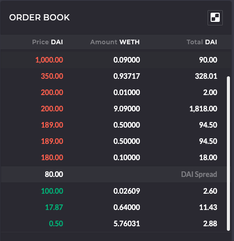
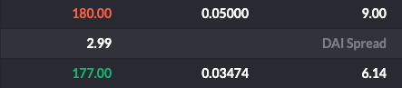
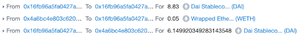
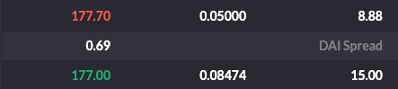
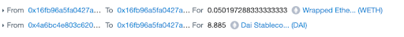
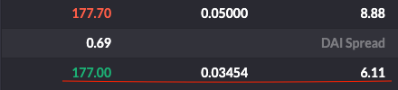

# Intro to the OasisDEX Protocol

**Level**: Beginner  
**Estimated Time**: 45 - 60 minutes

- [Intro to the OasisDEX Protocol](#intro-to-the-oasisdex-protocol)
  - [Overview](#overview)
  - [Learning Objectives](#learning-objectives)
  - [Pre-requisites](#pre-requisites)
  - [OasisDEX Protocol](#oasisdex-protocol)
    - [**High Level Overview**](#high-level-overview)
    - [**Maker-OTC Contract Structure**](#maker-otc-contract-structure)
    - [**Making your first order**](#making-your-first-order)
      - [Approve OasisDEX in DAI & WETH](#approve-oasisdex-in-dai--weth)
      - [Reading the market](#reading-the-market)
      - [**Making a limit buy order**](#making-a-limit-buy-order)
    - [**Making a limit sell order**](#making-a-limit-sell-order)
    - [**Cherry-picking an offer from the order book**](#cherry-picking-an-offer-from-the-order-book)
    - [**Cancelling your order**](#cancelling-your-order)
  - [Summary](#summary)
  - [Troubleshooting](#troubleshooting)
  - [Resources](#resources)

This guide is based on the [Kovan deployed](https://kovan.etherscan.io/address/0xe325acB9765b02b8b418199bf9650972299235F4) [maker-otc contract](https://github.com/makerdao/maker-otc). This guide can also be used with the [mainnet deployment](https://etherscan.io/address/0x794e6e91555438aFc3ccF1c5076A74F42133d08D).

## Overview

The OasisDEX Protocol enables you to trade in a completely decentralised manner. The entire trading process does not require an operator and is non-custodial. Besides the [oasis.app/trade](https://oasis.app/trade) implementation by Maker Foundation, there are other third party Dapps using the OasisDEX protocol contracts, such as:

- <https://dydx.exchange/>
- <https://dex.ag/>
- <https://dexindex.io/>
- <https://forkoasisdex.com>
- <https://forkoasisdex.com/direct/>
- <https://kyberswap.com/swap>

This guide will introduce you to the structure of the maker-otc smart contract that powers the OasisDEX Protocol and show you how you can make trades through the command line.

## Learning Objectives

In this guide, you'll learn the basics of the OasisDEX protocol and trade ETH and DAI through the command line. In addition, this will give you an understanding on how to implement the function calls into your own app or custom smart contract.

## Pre-requisites

You'll need to know these concepts in order to continue with this guide:

- Solidity
- [Dapptools](https://github.com/dapphub/dapptools) - Dapp, Seth
- [What defines a Decentralised Exchange](https://hackernoon.com/the-world-of-decentralised-exchanges-on-the-ethereum-network-an-overview-ee25fc5f9f)
- [OTC Market](https://www.investopedia.com/terms/o/over-the-countermarket.asp)

## OasisDEX Protocol

*Before starting this guide please install [dapptools](https://dapp.tools/) and [setup seth](https://github.com/makerdao/developerguides/blob/master/devtools/seth/seth-guide-01/seth-guide-01.md) for use with the Kovan testnet.*

### **High Level Overview**

The OasisDEX protocol uses an on-chain order book and a matching engine. The main advantage to this design is that liquidity is available for other smart contracts to access in one atomic transaction.

An order book for each market is implemented as two double-linked sorted lists, one list for each side of the market (buy and sell). An important feature of the design is that at any point in time, the lists should be sorted accordingly. The second most important design consideration when building the protocol was the use of an Escrow model for Makers. The Escrow model simply means that a given asset is locked within the contract when a new order is placed. Although such an approach locks down the liquidity, it guarantees a zero counterparty risk and instantaneous settlement.

### **Maker-OTC Contract Structure**

The trading engine involves the main contract [matching_market.sol](https://github.com/makerdao/maker-otc/blob/master/src/matching_market.sol) importing [simple_market.sol](https://github.com/makerdao/maker-otc/blob/master/src/simple_market.sol) and [expiring_market.sol](https://github.com/makerdao/maker-otc/blob/master/src/expiring_market.sol).

Through the matching_market.sol contract, you can make all the necessary calls to the maker-otc trading engine.

**Note:** It is recommended to make direct function calls to the maker-otc contract if you are intending to build other smart contracts that communicate with the maker-otc contract or build a trading bot. Example of this is the [dydx exchange](https://dydx.exchange/). However, if you’re integrating this maker-otc engine for wallets or UIs, then it is recommended to use the [Oasis Direct proxy contracts](https://github.com/makerdao/oasis-direct-proxy).

To find all the functions available for this contract, check the source code on [etherscan](https://kovan.etherscan.io/address/0xe325acB9765b02b8b418199bf9650972299235F4#code). Below is a list of the main functions you can use from this contract:

- **offer(pay_amt, pay_gem, buy_amt, buy_gem, pos)** - the main API of the matching engine. This method should be used 99% of the time!
  - uint pay_amt - the maker (ask) sell amount.
  - ERC20 pay_gem - the maker (ask) to sell specified collateral token (address).
  - uint buy_amt - the taker (ask) buy amount.
  - ERC20 buy_gem - the taker (ask) buy of a specified collateral token (address).
  - uint pos - the position to insert an offer.
- **getBestOffer(ERC20 sell_gem, ERC20 buy_gem)** - gets an offer from the top of the order book.
- **getWorseOffer()/getBetterOffer()** - these are both used for the navigation through an order book.
- **getOfferCount()** - returns the size of the order book.
- **getOffer(uint id)** - return information about the order with a given order ID.
- **buy()** - the buy function is used to fill a specific order (“cherrypicks”). By calling this function, it will execute and settle a trade all within one atomic transaction.
  - **Note**: Can be called externally by the user, and is also called internally by the matching engine (see offer() method for more details).
- **cancel()** - cancels an order with a given order ID.

### **Making your first order**

Before starting with the orders, let's setup the necessary env variables in your terminal. You'll need the main [maker-otc](https://kovan.etherscan.io/address/0xe325acB9765b02b8b418199bf9650972299235F4#code) (OASISDEX) contract address, the [DAI](https://kovan.etherscan.io/address/0x4F96Fe3b7A6Cf9725f59d353F723c1bDb64CA6Aa#code) token and the [WETH](https://kovan.etherscan.io/address/0xd0a1e359811322d97991e03f863a0c30c2cf029c#code) token address:

```bash
export OASIS=0xe325acB9765b02b8b418199bf9650972299235F4
export DAI=0x4F96Fe3b7A6Cf9725f59d353F723c1bDb64CA6Aa
export WETH=0xd0A1E359811322d97991E03f863a0C30C2cF029C
export ETH_GAS=3000000
```

#### Approve OasisDEX in DAI & WETH

Now we need to approve the OASISDEX contract to take funds from your wallet, DAI and WETH respectively. This is due to the fact of how OASISDEX is built, you need to allow the OASISDEX contract to take funds from your wallet in order to use the market functions (offer(), buy()...)

Let's define the amount we want to allow OASISDEX to withdraw. We'll set an equal amount for both tokens of 100,000. If you want to trade with higher units, just update the `$ALLOWANCE` to your preferred value.

```bash
export ALLOWANCE=$(seth --to-uint256 $(seth --to-wei 100000 eth))
```

To approve OASISDEX in DAI, execute the below command:

```bash
seth send $DAI 'approve(address,uint256)' $OASIS $ALLOWANCE
```

To approve OASISDEX in WETH, execute the below command:

```bash
seth send $WETH 'approve(address,uint256)' $OASIS $ALLOWANCE
```

#### Reading the market

In order to make an order on the market, you need to inform yourself of the current market prices. There are 2 ways to do this. One is to go to the [oasis.app/trade](https://oasis.app/trade) interface, make sure you're on Kovan, and see the order book. Or, call the OASISDEX contract functions to read the order book.



If reading from the interface, you can see the order book and the available orders in it. So, you can see that this order book has 3 bids and plenty of asks.

The best bid price to buy WETH is 100 DAI per WETH. The best ask price to buy DAI is 180 Dai per WETH. As seen from the figure, the market at 100 DAI and 180 DAI are very shallow, you can only buy 0.02609 WETH at 100 DAI and sell 0.1 WETH at 180 DAI.

Depending on the urgency of your order, you could fill these available orders or create a new order yourself and add it to the order book waiting for it to be filled.

Now, if you'd like to get the same information as from the interface, we need to read the OasisDEX contract directly.

Say we want to find the best offer on the WETH/DAI market, i.e. we want to purchase WETH with DAI and I want to know the best offer available. We can do this with the `getBestOffer(ERC20 sell_gem, ERC20 buy_gem)` function. This function returns you the best offer available on the order book for your specified market. The return value of this function is an id.

Let's get the id of the best offer of the WETH/DAI market. The command below gets the id of the best offer and converts it to a decimal number.

```bash
seth --to-dec $(seth call $OASIS 'getBestOffer(address,address)' $DAI $WETH)
```

Output: `3411`

**Note**: You will get a different order id, so make sure to change the parameters to the id from your terminal.

Now we can find more information about this order by using the getOffer(uint id) function. This function returns the pay and buy amount of each token respectively. Execute the below command to find order details of order `3411`:

```bash
seth call $OASIS 'getOffer(uint)(uint,address,uint,address)' 3411
```

Output:
`8ac7230489e80000` -> Pay amount in DAI
`4f96fe3b7a6cf9725f59d353f723c1bdb64ca6aa` -> DAI Token Address
`6345785d8a0000` -> Buy amount in WETH
`d0a1e359811322d97991e03f863a0c30c2cf029c` -> WETH Token Address

You can convert the hex outputs of DAI and WETH amounts to decimal:

```bash
seth --from-wei $(seth --to-dec 8ac7230489e80000)
seth --from-wei $(seth --to-dec 16345785d8a0000)
```

Reading from the above output, we can see that the best order offer is 10 DAI per 0.1 WETH. Meaning that you can buy 1 WETH at a price of 100 DAI (10/0.1 = 100) in this offer.

If you'd like to know the best offer for the WETH/DAI market, follow the above instructions but change the parameters in the getBestOffer() function. Instead of `getBestOffer(address,address) $DAI $WETH`,  enter `getBestOffer(address,address) $WETH $DAI`.

#### **Making a limit buy order**

Now that you have the right information, you can start making an order. Say you want to buy WETH with DAI at a price of 177 WETH/DAI. Let's say, 15 DAI worth of WETH: `15/177 = 0.084745`. You'll make an order for `15 DAI for 0.084745 WETH`.

To make an order on OasisDEX, we need to call the offer() function.

Let's set the necessary parameters for the offer() function. Besides the pay and buy amounts that we need to define, we also need to add the pos parameter to the function. Position parameter is a number that represents an order id. We use this parameter to tell the trading engine where to place the order. If we know where our order should be placed, then we take the closest order id and use that as as a pos parameter.

In our case, we can set pos parameter to 3411. This way, the engine will know exactly where to place the offer. In addition, you can also set the pos parameter to 0. This will make the engine search the complete order book to find a position for your order. This leads to higher gas usage for your transaction, which could lead to a failed transaction. So, it is recommended to set a position yourself.

With seth, we need to convert our 15 Dai units to eth denomination, i.e. setting the number to 18 decimal points. Hence, you’ll see $(seth --to-wei 15 eth).

```bash
export pay=$(seth --to-uint256 $(seth --to-wei 15 eth))
export buy=$(seth --to-uint256 $(seth --to-wei 0.084745 eth))
export pos=3411
```

Let's execute the offer function:

```bash
seth send $OASIS 'offer(uint,address,uint,address,uint)' $pay $DAI $buy $WETH $pos
```

We can see the order appear on the oasis.app interface:



However, as you can see, more than half of my order has been filled by the matching engine of Oasis. Now if we look at [etherscan's](https://kovan.etherscan.io/tx/0x21b7267d966f5cf64e684b18aed553d98c946250756a77841ce4232ab9d6f389) transaction overview:



(this example uses addresses from a previous deployment)

I can see that I've paid 8.83 DAI for 0.05 ETH, which means a price of 176.6 DAI (8.83/0.05=176.6). The rest of 6.14 DAI has been put in the order book waiting to be filled.

### **Making a limit sell order**

The limit sell order consists of selling WETH for DAI. We can do a sell order with the same offer() function as we did with buy order. Now, we just need to change the pay_amount and buy_amount parameters. Pay_amount is 0.05 WETH and buy_amount is 8.885 DAI, this leads to a price of 177.7 DAI/WETH (8.885/0.05 = 177.7).  

Update the env variables:

```bash
export pay=$(seth --to-uint256 $(seth --to-wei 0.05 eth))
export buy=$(seth --to-uint256 $(seth --to-wei 8.885 eth))
export pos=1
```

Execute the below command to set a sell limit order:

```bash
seth send $OASIS 'offer(uint,address,uint,address,uint)' $pay $WETH $buy $DAI $pos
```



We can see that our order has appeared on the order book.  

### **Cherry-picking an offer from the order book**

Making a limit order and letting the contract match you with existing orders as described above is the recommended way of trading on the OasisDEX contract. However, sometimes, you might find a specific offer in the order book that you would like to trade on. A good example is if you want to build a trading bot. When this is the case, you could use the buy(uint id, uint amount) function. The first parameter is the id of the offer, which you can get with getBestOffer() function, and the second parameter is the amount you'd like to buy.  

Let's buy some DAI that is being sold at 177 DAI/WETH.
First, let's get the order id of this offer:

```bash
seth --to-dec $(seth call $OASIS 'getBestOffer(address,address)' $DAI $WETH)
```

Output: `3423`

Now, let's define the amount we want to buy. We can see that this order offers 15 Dai. Let's buy 8.885 DAI.

```bash
export buy=$(seth --to-uint256 $(seth --to-wei 8.885 eth))
```

After setting the parameters, now we can invoke the buy() function.

```bash
seth send $OASIS 'buy(uint,uint)' 3423 $buy
```




We can see from the above figures that we paid 0.0501 WETH for 8.885 DAI. As well, the order in the order book has decreased its offer accordingly.

### **Cancelling your order**

Cancelling your order can be executed by the cancel(uint id) function. So, if we want to cancel the 177 DAI/WETH offer we need the order id, which we already know from above (3423).

Execute bellow command to cancel order 3423

```bash
seth send $OASIS 'cancel(uint id)' 3423
```

If you look at the order book and your transaction on kovan.etherscan.io, you'll see that the remaining Dai was returned to you and the order has disappeared from the order book.

## Summary

In this guide we have introduced you to the OasisDEX Protocol (maker-otc contract) that is live on [oasis.app/trade](https://oasis.app/trade) marketplace. You have been shown commonly used functions within maker-otc contract, and we walked through examples by making some trades.

## Troubleshooting

If you have any questions, feel free to reach to our rocket chat channel at: <https://chat.makerdao.com/channel/dev>

## Resources

- [Maker-otc contract](https://kovan.etherscan.io/address/0x4a6bc4e803c62081ffebcc8d227b5a87a58f1f8f#code)
- [Maker-otc repo](https://github.com/makerdao/maker-otc)
- [Dapptools](https://github.com/dapphub/dapptools)
- [Setup seth](https://github.com/makerdao/developerguides/blob/master/devtools/seth/seth-guide-01/seth-guide-01.md)
- [Overview of Dexes](https://hackernoon.com/the-world-of-decentralised-exchanges-on-the-ethereum-network-an-overview-ee25fc5f9f)
- [What is OTC](https://www.investopedia.com/terms/o/over-the-countermarket.asp)
