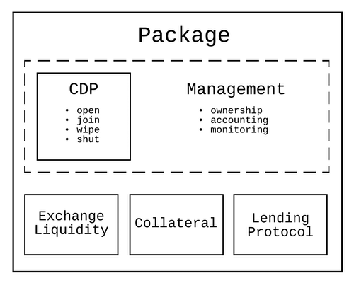

# CDP Integration Guide

**Level**: Intermediate

**Estimated Time**: 90 - 120 minutes

- [CDP Integration Guide](#cdp-integration-guide)
  - [Overview](#overview)
  - [Learning Objectives](#learning-objectives)
  - [Pre-requisites](#pre-requisites)
  - [Guide](#guide)
    - [CDP Integration](#cdp-integration)
      - [CDP Lifecycle](#cdp-lifecycle)
        - [Open](#open)
        - [Manage](#manage)
        - [Close](#close)
      - [Integration Tools](#integration-tools)
        - [Dai.js](#daijs)
          - [MCD Dai.js Example](#mcd-daijs-example)
        - [CDP Manager](#cdp-manager)
    - [CDP Management](#cdp-management)
      - [Ownership](#ownership)
      - [Adjustment](#adjustment)
      - [Accounting](#accounting)
        - [Individual CDPs](#individual-cdps)
        - [Shared CDP](#shared-cdp)
      - [Monitoring](#monitoring)
      - [Liquidation Support](#liquidation-support)
    - [CDP Packaging](#cdp-packaging)
      - [Components](#components)
        - [Exchanges](#exchanges)
        - [Lending protocols](#lending-protocols)
  - [Troubleshooting](#troubleshooting)
  - [Summary](#summary)
  - [Additional resources](#additional-resources)
  - [Next Steps](#next-steps)
  - [Help](#help)

## Overview

Collateralized Debt Positions(CDPs) can accept a wide variety of tokenized collateral, representing both crypto and real world assets, and give users the ability to borrow Dai against this pledged collateral. Custom CDP portals can leverage this versatility along with the open developer platform to make it easier for users to better manage their CDPs and can also go further and package CDPs with other financial components to build products tailored for their needs.

## Learning Objectives

After going through this guide you will get a better understanding of,

- CDP Integration SDKs
- CDP management for different user types
- CDP packaging with other financial components

## Pre-requisites

You will need a good understanding of these concepts to be able to work through this guide,

- [MCD 101](https://github.com/makerdao/developerguides/blob/master/mcd/mcd-101/mcd-101.md), especially:
  - Collateralized Debt Position(CDP) basics.
  - Governance Risk parameters.

## Guide

CDPs are designed to give users easy and permissionless access to generate their own Dai with features such as no fixed term limits, per second interest compounding, and up to 45 decimals of precision when accounting for debt. As a developer building a custom CDP integration, you can go beyond building a simple CDP portal that exposes basic CDP options to users and differentiate your offering with additional features around two dimensions--- CDP management and packaging.

Some examples of portals that have built custom CDP integrations,

- Using proxy contracts for CDP management, InstaDapp integrates with liquidity sources like Kyber Network to help users that don't have MKR in their wallets to pay stability fees with ETH. InstaDapp also packages CDPs with Compound (another lending protocol) to create a bridge that allows users to migrate their CDP between Compound and the Maker protocol to access competitive rates.
- DefiSaver packages CDPs with ETH/DAI liquidity from the Eth2Dai DEX to allow owners to self-liquidate their CDP before incurring a liquidation penalty from the protocol.
- Keydonix packages CDPs with their internal ETH liquidity along with the Eth2Dai DEX to create ETH margin long positions in a single iteration.
- Tinlake allows users to borrow Dai by locking NFTs on their lending platform which packages CDPs on their backend.


*Illustration of a CDP packaged with various components*

The possibilities to both differentiate and serve users are endless, and we will outline some general principles to help you architect and develop your custom CDP integration in the following sections of this guide,

- CDP integration: Lifecycle and Integration SDKs
- CDP management strategies for various user types
- CDP packaging with other financial components
- Examples

### CDP Integration

#### CDP Lifecycle

Every CDP in the system goes through these stages in its lifecycle.

##### Open

Users lock the tokens they own from any of the accepted collateral types into a CDP. A CDP will stay safe as long as its Dai debt remains below the limit set in the system through the liquidation ratio. Ex: Ether's collateralization ratio is 150% and currently trades at 100 USD. A user is allowed to generate a maximum of 66.66 DAI for every ETH locked. Users continue to own the collateral they have locked in a CDP and accrue gains or losses by staying invested in the asset. They are also able to use the generated Dai to purchase other assets they desire from various exchanges or merchants.

##### Manage

Once it is open, it is now the user's responsibility to ensure the CDP remains safe even when the price of the locked underlying collateral fluctuates. Users will know the future price that will be used to revalue their CDP up to an hour in advance. If the value of the collateral goes down, users can take action by either locking additional collateral or reducing debt (by paying back) to keep the CDP safe.

##### Close

Users can close their own CDPs anytime by paying off the debt recorded in it with Dai which is a sum of Dai directly borrowed by the user and accrued stability fees that the system increases continuously as additional debt on the CDP.

A CDP becomes unsafe when its total debt becomes greater than the required minimum collalteralization ratio. When this happens, the system cancels the accrued debt and liquidates the CDP. It adds a liquidation penalty on the CDP and then auctions the locked collateral to raise the Dai required to cancel the debt before returning any remaining collateral back to the CDP owner.

#### Integration Tools

There are multiple ways to integrate with the Maker products: Smart contracts, Dai.js JavaScript SDK, and the [pymaker](https://github.com/makerdao/pymaker) Python SDK. The choice of which tool to choose relies mostly on your in house design philosophy, software architecture and tools arsenal.

We can recommend one tool over another according to our experience, however you or your software architect would have a better understanding of what could be used in your system.

##### [Dai.js](https://makerdao.com/documentation/)

Link to documentation: [https://makerdao.com/documentation/](https://makerdao.com/documentation/)

By opting the Dai.js route, you will have a library full of ready to use features that can be plugged into your own infrastructure. This library supports both frontend and backend applications and is also used in products delivered by the Maker Foundation. It allows you to focus mostly on your product design and not much on the internal plumbing on managing a web3 instance with contract ABIs.

Nonetheless, you will have to depend on the Dai.js maintainers to build new features or update functionality when need arises.

###### MCD Dai.js Example

Currently, Dai.js has a plugin that enables interaction with the MCD Kovan deployment, the `[dai-plugin-mcd](https://github.com/makerdao/dai.js/tree/dev/packages/dai-plugin-mcd)`. When MCD will be released, this plugin will become the default part of the Dai.js library. This plugin uses the DS-Proxy via the CDP Manager.

A quick example of opening the multi-collateral CDP with Dai.js would look like this:
Make sure to run [node 11.10](https://nodejs.org/download/release/v11.10.0/) and follow install [instructions](https://github.com/makerdao/dai.js).  

```javascript
    // Importing the necessary dependencies
    import McdPlugin, { ETH, REP, MDAI } from '@makerdao/dai-plugin-mcd';
    import Maker from '@makerdao/dai';

    //Defining the maker object with necessary configurations
    const maker = await Maker.create('http', {
    privateKey: YOUR_PRIVATE_KEY,
        url: 'https://kovan.infura.io/v3/YOUR_INFURA_PROJECT_ID',
        plugins: [
            [
                McdPlugin,
                {
                    network: 'kovan',
                    cdpTypes: [
                        { currency: ETH, ilk: 'ETH-A' },
                        { currency: REP, ilk: 'REP-A' },
                    ]
                }
            ]
        ]
    });
    await maker.authenticate();
    await maker.service('proxy').ensureProxy();
    const cdpManager = maker.service('mcd:cdpManager');
    /*
    Opening a CDP with the REP token as collateral.
    This is done in one function call with the help of the proxy contract
    In one function call, the user opens a CDP, locks 50 REP tokens and draws 70 Dai
    */
    await cdpManager.openLockAndDraw('REP-A', REP(50), MDAI(70));

    /*
    Closoing a CDP requires getting the CDP Id and passing it to the wipeAndFree()
    function
    */
    let proxy = await maker.currentProxy();
    let cdps = await cdpManager.getCdpIds(proxy);
    await cdpManager.wipendFree(cdps[0].id, 'REP-A', MDAI(70), REP(50))
```

We have some example projects that can show you how to use Dai.js:

- [Dai.js MCD Plugin Example](https://github.com/makerdao/integration-examples/tree/master/mcd-dai)
- [Governance Dashboard](https://github.com/makerdao/governance-dashboard)
- [MCD-CDP-Portal](https://github.com/makerdao/mcd-cdp-portal)

##### [CDP Manager](https://github.com/makerdao/dss-cdp-manager)

Another way to interact with CDPs is through the Maker contracts.

CDP Manager is our public facing interface contract that allows anyone to easily interact with the MCD system. This is the recommended way to interact with the Maker protocol. You can find some examples that show a simple CDP lifecycle with CDP Manager [here](https://github.com/makerdao/developerguides/blob/master/mcd/mcd-seth/mcd-seth-01.md).

If you want to abstract many individual contract calls into one, then you can use our [proxy contract](https://github.com/makerdao/dss-proxy-actions) that uses the CDP Manager to interact with the system. In the proxy contract, the owner of the CDP is the proxy address and not the user's address. Clearly, the user's address is the owner of the proxy, so there's a link between the two addresses. Please refer to the [Working with DSProxy](https://github.com/makerdao/developerguides/blob/master/devtools/working-with-dsproxy/working-with-dsproxy.md) guide to understand proxy contracts are used interact with the core system.

In the example of a custodial exchange, using the CDP Manager could bring more options to operate with the MCD system on the exchange, as this allows easy control of the CDP lifecycle. The exchange can open CDP's for the users and link the CDP Id to the user Id, hence having a link to the user for accountability.

### CDP Management

A CDP portal is a gateway for a user for managing a CDP. It can help them to lock collateral and open one, hold custody over it if required, provide monitoring and notification support for important changes that could affect its safety, and provide options to adjust collateral or debt either automatically or with user actions.

#### Ownership

A portal can either offer custodial support and hold ownership of the CDP on behalf of the user or it can let the user hold it through their preferred Dapp wallet. Both these options can provide users with a different set of benefits.

In the non-custodial integration, the portal incurs less liability since the user is responsible for the safety of their own CDP, but it can only provide limited CDP management options and cannot pro-actively act to protect them from liquidation when the user is absent.

The authorization model allows the owner of a CDP to approve other addresses by adding them to the `can` list to manage the CDP on their behalf. This could potentially allow joint ownership of the CDP by both the portal and the user simultaneously.

#### Adjustment

Once a CDP is open, the user is able to adjust both the collateral locked as well as the debt of the CDP. We can divide all adjustment actions into two types- Safe and Unsafe actions.

Safe actions are open for all addresses to perform on a CDP and ownership checks are not done on the caller since they can only improve the safety of a CDP by either increasing the amount of collateral locked or decreasing the debt.

Unsafe actions on the other hand can only be performed by an address that either owns the CDP or is authorized by the owner since they can remove collateral locked or increase debt in the CDP.

Custodial portals can leverage the difference between authorization models for safe and unsafe actions when designing hot and cold storage infrastructure for CDP management.

#### Accounting

CDP accounting is handled by the core CDP database contract - `Vat`. Users can also maintain a separate unlocked collateral balance `gem` for each collateral type `ilk` in the system by transferring assets into token adapters to gain a corresponding internal balance on `Vat`. Every CDP accounts for two key values- locked collateral `ink`  and debt units `art`.

Both `ink` and `art` use the number type `wad` which is an 18 decimal fixed-point number. You can read more details about the number types and their math form the DSMath library [documentation](https://dapp.tools/dappsys/ds-math.html).

A user can interact with the CDP to either lock or unlock collateral or to generate or payback Dai anytime. Similarly MKR token holders can also continuously update the Risk Premium `duty` assessed on a collateral type as well as the Dai Savings Rate(DSR) `base` on all CDPs in the system.

Even with the limited computational capacity of the Ethereum network, the fee accumulator model developed by the Maker team allows the system to precisely account for all the changes made to the stability fee during a CDP's lifetime. Debt of a CDP can be computed anytime by multiplying the debt units `art` with the stability fee accumulator of the collateral type `rate`. More details on stability fee math will be discussed in a future guide.

For custodial CDPs a portal needs to take care of additional accounting depending on how the CDPs are setup.

##### Individual CDPs

Portals need not manage additional accounting if a single CDP is opened for every user and they stay isolated from others.

##### Shared CDP

Managing the custody of an individual CDP on behalf of each user can be hard and it might be easier if all user positions managed by the portal are rolled into one shared CDP. As a portal developer, it will then be your responsibility to maintain the safety of the aggregate position while allowing users to update their positions.

A minimum of one CDP per collateral type will be required.

Accounting of individual positions can either be done in a database or by setting up a private Maker protocol setup on internal Ethereum nodes and tracking individual user positions by replaying their actions on it while updating the risk parameters whenever they are updated on the mainnet shared CDPs.

Fees can be charged by the portal operator to cover additional costs like ethereum transaction fees and need to be accounted for separately.

#### Monitoring

Portals can notify users about various topics to help them better manage their CDPs,

- Safety, especially when a CDP is close to liquidation
- Price of collateral
- Stability fee updates
- Risk parameter updates- Liquidation Ratio, Debt Ceiling
- Governance and Executive Proposals that could change CDP various risk parameters.
- Suggestions to save stability fees by migrating the CDP to other collateral types or lending services.

#### Liquidation Support

Unsafe CDPs that breach their collateralization ratio are liquidated by the Maker protocol as a last resort to reduce overall risk in the system and to keep it well collateralized. To prevent CDP owners from misusing this mechanism through [auction grinding attacks](https://github.com/livnev/auction-grinding/blob/master/grinding.pdf), a liquidation penalty is also tacked.

As a part of CDP management, a portal can also help the user avoid a hard liquidation by the protocol. It can source liquidity from either centralized or decentralized exchanges to exchange the locked collateral for Dai to payback either a portion of the debt or fully to unwind the CDP. In a custodial setup, a portal can even do this without the user having to perform any action.

### CDP Packaging

Generating Dai from a CDP is the just the first step that creates debt which needs to be used elsewhere. Packaging other products that accept Dai as components of your integration to put the generated Dai to immediate use will make it a seamless experience for the user.

For example, using a decentralized protocol to create a margin long position on an asset is very attractive due to vastly reduced counter-party risk that centralized exchanges have. Creating such a position on Ether using a CDP would involve a series of steps that first generate Dai, move it to an exchange to buy more Ether, lock the newly bought Ether again in the CDP, and repeat the process manually until the desired leverage is reached. A custom CDP portal can make this experience seamless by turning it into a one step process that is user friendly by combining liquidity available on exchanges and removing the need to sign multiple transactions.

#### Components

Examples of components that can be packaged with a CDP are,

##### Exchanges

Exchanges can supply liquidity to the custom CDP portal for all the asset trades that happen across various stages of a CDP lifecycle. A user may need to exchange tokens for collateral that is accepted by the Maker protocol to open a CDP. Exchanges are also required when the user wants to swap Dai for a target asset to make a speculative long trade. The ability to source liquidity with low slippage on trades could be a great competitive advantage for the custom CDP portal.

##### Lending protocols

Lending protocols match lenders and borrowers that suppy assets to the protocol. Users can lock the Dai generated from a CDP as a lender on the lending protocol to borrow other assets from it. Selling the borrowed asset typically creates a speculative short trade for the user.

## Troubleshooting

## Summary

Debt expands possibilities for users on what they can achieve with the assets they hold in their wallet without having to sell them. In this guide we discussed how you as a custom CDP portal developer can turn these possibilities into great user experiences by providing users with the tools they need to manage CDPs  and also create channels for collateral and Dai to seamlessly move in and out of a CDP through packaging with other products.

## Additional resources

1. Stability Fees Calculation Guide

## Next Steps

Please read the Collateral Onboarding Framework to get a better understanding of how a new collateral type can be added to the Maker protocol.

## Help

- Contact Integrations team - integrate@makerdao.com
- Rocket chat - #dev channel
