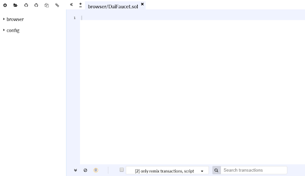
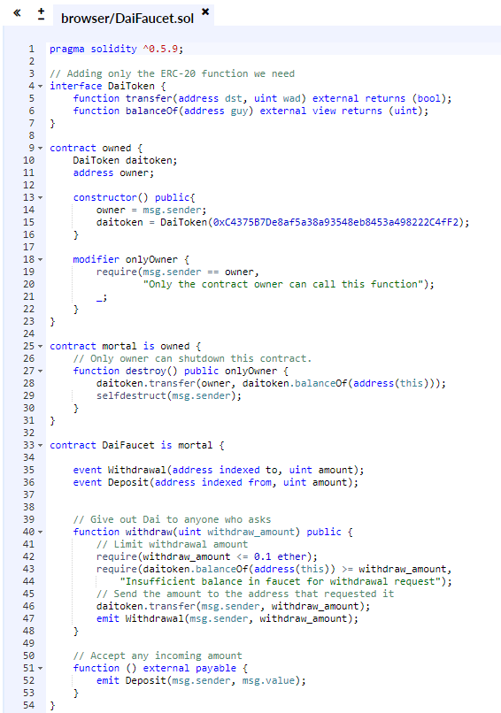
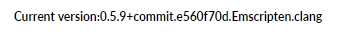
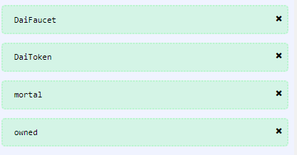
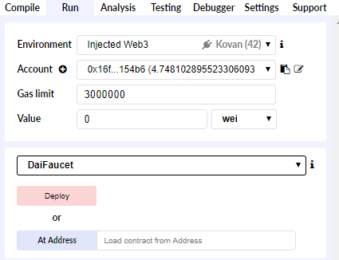
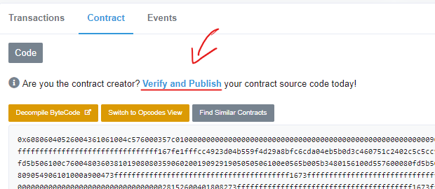
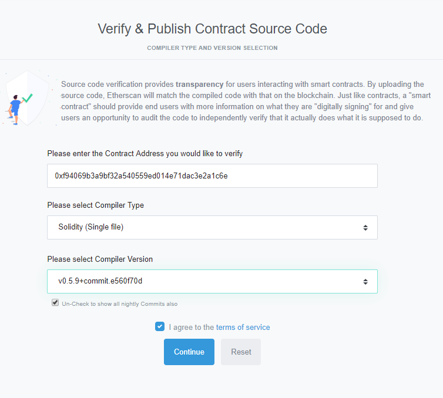
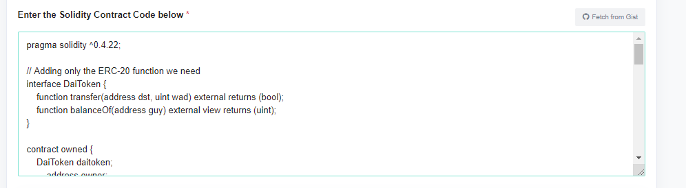
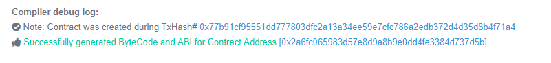
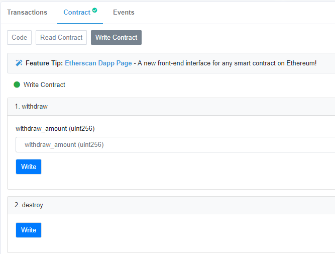

# Dai in Smart Contracts

**Level**: Beginner  
**Estimated Time**: 30 minuntes

- [Dai in Smart Contracts](#dai-in-smart-contracts)
  - [Overview](#overview)
  - [Learning Objectives](#learning-objectives)
  - [Pre-requisites](#pre-requisites)
  - [Sections](#sections)
    - [Setup](#setup)
    - [Write your code](#write-your-code)
      - [Dai Token Interface](#dai-token-interface)
      - [Contract Ownership](#contract-ownership)
      - [Kill Switch](#kill-switch)
      - [Dai Faucet](#dai-faucet)
    - [Deploy Smart Contract](#deploy-smart-contract)
      - [Make sure you have chosen the right compiler](#make-sure-you-have-chosen-the-right-compiler)
      - [Check if there are no errors](#check-if-there-are-no-errors)
      - [Deploy](#deploy)
    - [Use Faucet](#use-faucet)
      - [Verify Contract](#verify-contract)
  - [Summary](#summary)
  - [Additional resources](#additional-resources)
  - [Help](#help)

## Overview

This guide will show you how to integrate Dai into your own smart contracts. Dai is a decentralized stablecoin built on Ethereum. The Dai token is based on the [DS-Token](https://dapp.tools/dappsys/ds-token.html) implementation which follows the ERC-20 token standard with minor additions.

## Learning Objectives

- Learn how to integrate the Dai token into your smart contracts.
- Write a simple Dai Faucet contract.

## Pre-requisites

- Basic knowledge of the Solidity programming language
- Knowledge of the [ERC20 token standard](https://github.com/ethereum/EIPs/blob/master/EIPS/eip-20.md)

## Sections

- [Setup](#setup)
- [Write your code](#write-your-code)
- [Deploy Smart Contract](#deploy-smart-contract)
- [Use Faucet](#use-faucet)

### Setup

To start things off, we will deploy our contract on the Ethereum Kovan network as we have deployed our Dai token on the same network.
In addition, you’ll need:

- [Metamask](https://metamask.io/)
- [Kovan ETH](https://github.com/kovan-testnet/faucet)
- Kovan Dai (lock Kovan-ETH on [oasis.app](http://oasis.app/borrow))

For simplicity, we will use <https://remix.ethereum.org> in browser IDE. Watch this [intro](https://www.youtube.com/watch?v=xxJfQJ5bMfw) in case you are not comfortable with this development environment.

One of the simplest contract examples we can use that can showcase the integration of the Dai token is a contract faucet. As you already used a faucet to get some Kovan ETH, we will work on creating a faucet that will give you some Kovan Dai tokens. It is a great tool to build for your test network when you want to allow many users to test your application before you deploy it on mainnet.

### Write your code

We will build a faucet contract that you will be able to control and terminate in case you desire to do so.
In your [Remix IDE](https://remix.ethereum.org/) browser tab, create a new file named **DaiFaucet.sol**.  
It should look like this:



Now we will add our necessary blocks of code that will form our DaiFaucet contract.

#### Dai Token Interface

First, we add the solidity version that the code will be compiled into the EVM.

```solidity
pragma solidity ^0.5.9;
```

To enable our faucet contract to recognize and interact with the Dai token contract we need to write an interface that will map the Dai token functions that we’ll use. In this case, that means the **transfer()** and **balanceOf()** functions, since we will need our contract to transfer Dai to whomever requests it and also to check the balanceOf its Dai holdings to know if it can transfer in the first place. We will need to instantiate this interface later in the codebase.

```solidity
// Adding only the ERC-20 function we need
interface DaiToken {
    function transfer(address dst, uint wad) external returns (bool);
    function balanceOf(address guy) external view returns (uint);
}
```

#### Contract Ownership

Now we will set up supporting contracts that will manage ownership and control of our faucet contract. The **owned** contract sets up the contract creator as the one in control, it sets the **DaiToken daitoken** variable and the **owner** variable. It creates the **onlyOnwer** modifier function that adds restrictions to who can call other functions in our faucet contract.

When we deploy our contract to the Kovan network, the constructor function will set the **owner** variable to the address of the calling Ethereum account, and set the **daitoken** variable to the address of the Dai token contract on the Kovan network, which is [0x4f96fe3b7a6cf9725f59d353f723c1bdb64ca6aa](https://kovan.etherscan.io/token/0x4f96fe3b7a6cf9725f59d353f723c1bdb64ca6aa).
Now the **DaiToken** interface will link to the Dai token address on the kovan network. So when we call the **transfer** or **balanceOf** functions, they will call the functions of the Dai token contract.

```solidity
contract owned {
    DaiToken daitoken;
    address owner;

    constructor() public{
        owner = msg.sender;
        daitoken = DaiToken(0x4F96Fe3b7A6Cf9725f59d353F723c1bDb64CA6Aa);
    }

    modifier onlyOwner {
        require(msg.sender == owner,
        "Only the contract owner can call this function");
        _;
    }
}

```

#### Kill Switch

Moving on, we will add another contract that will inherit the **owned** contract. We will call it **mortal**, as in, we will give our contract a kill switch that will terminate it and return any funds back to the owner. The **destroy()** function can only be called by the owner, hence the **onlyOwner** modifier.
Here you can see that we use the **daitoken** interface. We transfer any remaining Dai funds of the faucet contract to the owner.

```solidity
contract mortal is owned {
    // Only owner can shutdown this contract.
    function destroy() public onlyOwner {
        daitoken.transfer(owner, daitoken.balanceOf(address(this)));
        selfdestruct(msg.sender);
    }
}
```

#### Dai Faucet

Finally, we are writing the faucet contract. We can see that **DaiFaucet** inherits the **mortal** contract, which in turn inherits the **owned** contract. This way, we have modularised our contracts for their specific functions and added our total control over it.
Inside the contract we have two events that will watch and log every time there is a **Withdrawal** and a **Deposit** to/from this contract.

We have added the **withdraw** function that will take care to send Dai to anyone who calls this function. As you can see, we have added 2 conditions for the withdrawal:

- Require that the withdraw_amount is less or equal to 0.1 Dai
- Require that we have more Dai in the faucet than the withdraw_amount.

Only after these conditions are met we can transfer 0.1 Dai to the function caller. And of course, we log this transaction with the Withdrawal event. The way we send Dai to the function caller is by using the above defined DaiToken interface to allow us to make the transfer.

The unnamed function is here to receive any incoming payments our contracts gets and log the Deposit event.

```solidity
contract DaiFaucet is mortal {

    event Withdrawal(address indexed to, uint amount);
    event Deposit(address indexed from, uint amount);

    // Give out Dai to anyone who asks
    function withdraw(uint withdraw_amount) public {
        // Limit withdrawal amount
        require(withdraw_amount <= 0.1 ether);
        require(daitoken.balanceOf(address(this)) >= withdraw_amount,
            "Insufficient balance in faucet for withdrawal request");
        // Send the amount to the address that requested it
        daitoken.transfer(msg.sender, withdraw_amount);
        emit Withdrawal(msg.sender, withdraw_amount);
    }

    // Accept any incoming amount
    function () external payable {
        emit Deposit(msg.sender, msg.value);
    }
}

```

This is how it should look like when all the code blocks are put together:



### Deploy Smart Contract

To deploy this faucet on the Kovan network you need to change the network to Kovan on Metamask, choose the same compiler version as in the contract, compile the contract to see if there’s any errors and then deploy the DaiFaucet contract.

#### Make sure you have chosen the right compiler



#### Check if there are no errors



#### Deploy

Choose **DaiFaucet** from list of contracts to deploy. Make sure you are connected to Kovan and have a wallet with enough ETH. Deploy contract. You will be asked to confirm the transaction with Metamask.



You can check the transaction on Etherscan. If everything went well, you will see your new contract address.

### Use Faucet

Now that we have successfully deployed our smart contract on the Kovan network, we can interact with it. The simplest way to interact with the contract is through Etherscan. As you are the deployer of this contract, you have the source code. This means that you can publish the source code to Etherscan and verify the contract. This will allow you to interact with the contract on Etherscan with just your Metamask account. Easy, right?

#### Verify Contract

To verify your contract and publish your source code, navigate to your contract address on Etherscan and click on the **Verify and Publish** link.



Select compiler type to be **Single File**, since all your code is in one file.
Make sure to select the right compiler version that your contract has been compiled against and then press continue.



Paste the Solidity code below, and then press **Verify and Publish**.



If everything went according to plan, you should see something like this:



Congratulations! Your contract is verified, now you can interact with it from Etherscan with Metamask.

As you can see, you have two functions that you can interact with, **withdraw** and **destroy**. Before anyone can withdraw any Dai from the contract, make sure to send some to the contract address. After that, anyone would be able to withdraw maximum 0.1 Dai, as per the rule you put in the code. You will be requested to connect Metamask in order to use these functions.

When you think you have had enough with this contract, you can easily call the **destroy** function.



This concludes how you can integrate the Dai token into a Solidity smart contract.

## Summary

In this guide, we showcased how you can integrate the Dai token in a smart contract. We wrote a faucet smart contract that uses the Dai token contract that can send a small amount of Dai to anyone who asks. In addition, we walked through the process of writing, deploying and using this faucet contract.

## Additional resources

1. Knowledge of the [Dai Token](https://github.com/makerdao/developerguides/blob/master/dai/dai-token/dai-token.md)
2. [Integrating Dai Savings Rate](https://github.com/makerdao/developerguides/blob/master/dai/dsr-integration-guide/dsr-integration-guide-01.md)

## Help

- Rocket chat - [#dev](https://chat.makerdao.com/channel/dev) channel
