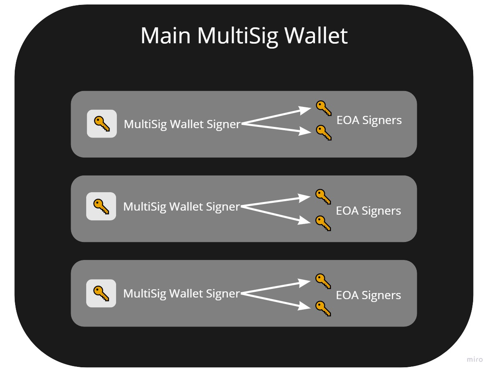

# Nested MultiSig Gnosis Safe Wallet - Setup Walkthrough

# Overview

In this document, you are going to learn how to create a safe nested MultiSig wallet structure for your own use/organization. 

# Use

The nested MultliSig wallet structure allows for a layer of abstraction where each signers is a role (instead of an EOA). A role can have more than one person assigned to it.

It is useful for:

- defining backup signers (reducing the bus factor)
- having multiple team members as part of a workflow

# Requirements

You must know:

- How wallets work on the Ethereum blockchain
- Access to Metamask or any major supported wallet on gnosis Safe platform
- How to acquire some test eth on the Rinkeby Test Network if you want to test your setup before you go to mainnet.

# Introduction

Having a MultiSig wallet in the crypto paradigm is a must when handling DAO or simple organization funds. The typical MultiSig setup is that you have two to three members from the organization that come with their own [EOA](https://blog.gnosis.pm/breaking-down-ethereum-wallets-options-2162b41477d7) (external own account ) wallets and form a MultiSig wallet. In this wallet, they are the signers or the approval agents for any transaction that happens in the MultiSig wallet. In other words, when the organization needs to interact with a contract or send funds from the MultiSig, its signers have to approve on this transaction with their own wallets that form the ownership of the MultiSig wallet. 

This kind of structure is simple and secure for an uncomplex organization, trust is put into the signers and it is expected that they are "online" when approvals need to be made and transactions executed. 

However, this is not the case when the organization becomes more complex and these signers could be offline when an approval is needed. What if the organization needs external auditors and accountants to approve the transactions. And how do you make sure those auditors/accountants are also online and at work when needed. 

In this case, creating a structure where the signers of the main MultiSig wallet are themselves a MultiSig with their own multiple signers can help alleviate the risks involved of using a simple MultiSig wallet. If one signer of the nested MultiSig wallet is offline, the other signer can approve the transaction.

Nested MultiSig Wallet Diagram

# Steps

Note: This has been done with the gnosis web app.

Before we go on to the step by step process, let's look at the structure of our MultiSig wallet that we want to create. Above image reflects the same structure below. 

- Main MultiSig Wallet
    - Owners
        - Nested MultiSig Wallet
        - Nested MultiSig Wallet
        - Nested MultiSig Wallet

Create four MultiSig wallets in the gnosis app. 

In the **Settings → Owners** add the three addresses of the MultiSigs you have just created and set the signing policies in the **Policies** option

Once the addresses are added, you should connect to the main MultiSig with the nested Multisig wallet to do a transaction. To achieve this, you have to use **WalletConnect** app in the Gnosis **APPS** menu. Check below the steps.

Open in another browser window one of the nested MultiSig wallets. So now you should have two browser windows, one connected to the main MultiSig wallet and another browser window connected to one of the nested MultiSig wallets. 

In the main MultiSig wallet window go to the wallet connection section and choose the **WalletConnect** option. 

Once you clicked on the **WalletConnect** option, you'll have a modal appear with a QR code. Click the **Copy to clipboard** button to copy the code so you can insert it in your nested MultiSig wallet **WalletConnect app**. 

Now, go to the other browser window where you have opened your nested MultiSig Wallet. Make sure to connect to your MultiSig wallet with your current wallet setup. Once you're in the MultiSig wallet, go to the **APPS** option and choose the **WalletConnect.** Once the **WalletConnect** window is opened, paste the copied code from the previous MultiSig window into the input bar. 

Once you have pasted the code, **WalletConnect** should be connected to the main MultiSig wallet. 

Keep in mind to keep this WalletConnect window open in your nested MultiSig wallet in order to make sure that everything works. 

### Executing a transaction

Now when you want to execute a transaction on the main MultiSig wallet, you simply go to the transaction tab and create a transaction. Once you submit it, a window in your second browser window where your nested MultiSig wallet is setup will appear asking for your confirmation to execute the transaction. 

Submitting transaction on the main MultiSig Wallet

Executing the transaction as a nested MultiSig Wallet for the main MultiSig Wallet

Once you click **Submit** on the nested MultiSig wallet you'll be prompted to sign the approval for your nested MultiSig wallet with your wallet structure you have chosen when you created the nested MultiSig wallet.  

Doing the final approval with your wallet setup in the nested MultiSig wallet

This is the process of handling transaction in a nested MultiSig wallet structure. Hopefully soon enough Gnosis team will improve their UI to make this process even easier. Up until then, this is what we got.