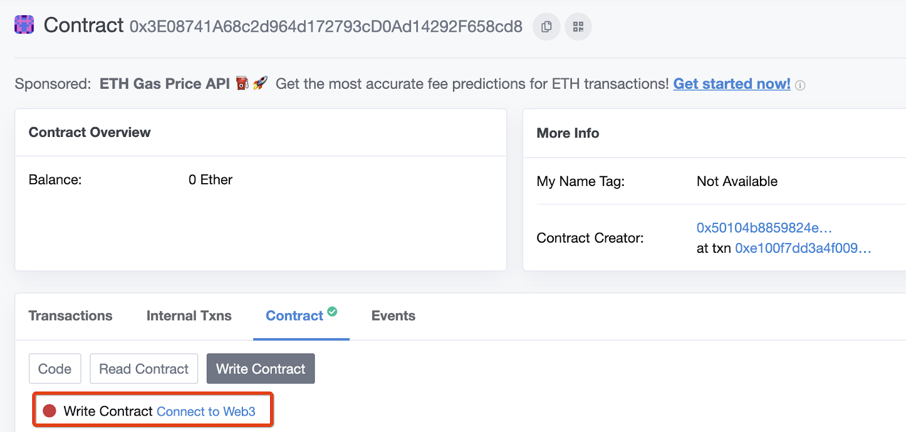
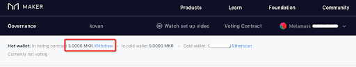

# VoteProxy Setup through Gnosis Multisig

**Level:** Intermediary  
**Estimated Time:** 60 minutes

- [VoteProxy Setup through Gnosis Multisig](#voteproxy-setup-through-gnosis-multisig)
  - [Overview](#overview)
  - [Pre-requisites](#pre-requisites)
  - [Learning objectives](#learning-objectives)
  - [Step 1: Initiate Link](#step-1-initiate-link)
  - [Step 2: Approve Link](#step-2-approve-link)
  - [Step 3: Approve MKR Transfer](#step-3-approve-mkr-transfer)
  - [Step 4: Lock MKR](#step-4-lock-mkr)
  - [Using this guide on Mainnet](#using-this-guide-on-mainnet)
  - [Summary](#summary)

## Overview

This guide describes a method of linking an old version of the Gnosis Multisig wallet (as the cold wallet holding MKR) to an online hot wallet for participating in MakerDAO governance by voting using the [Voting-Proxy contract](https://github.com/makerdao/vote-proxy) as described in this [article](https://blog.makerdao.com/the-makerdao-voting-proxy-contract/). This is the recommended method of voting and is utilized in the vote.makerdao.com governance dashboard.

This guide is meant to be used on the Kovan Testnet. After a test run, this guide can be used again on mainnet, along with the revisions (addresses, etc) located at the end.

## Pre-requisites

Basic knowledge of executing multisig transactions in the Gnosis Multisig UI.

## Learning objectives

In this guide, we will learn how to

- Set up the VoteProxy contract with a Gnosis Multisig wallet as the cold wallet

## Step 1: Initiate Link

To initiate the link, we need to call `initateLink(hotAddress)` with our multisig wallet. Make sure you have enough kovan MKR to conduct the test and enough kovan ETH on your multisig wallet to cover gas costs. [You can get kovan ETH here](https://github.com/kovan-testnet/faucet) and kovan MKR by reaching out to @kenton, @lollike, @petru.catana or asking around in the public channels of RocketChat!

- Go to <https://wallet.gnosis.pm/> and login with your wallet. This is the old version of Gnosis Multisig.

- Navigate to the “Wallets” page, and click on the specific multisig wallet name, to enter the user interface for the specific multisig wallet.

- Under “Multisig transactions” press “Add”

- In the “Destination” field input the address of the

  - `VoteProxyFactory: 0x3E08741A68c2d964d172793cD0Ad14292F658cd8`

- In the “ABI string” window copy and insert the entire VoteProxyFactory ABI text string from this [etherscan link](http://api-kovan.etherscan.io/api?module=contract&action=getabi&address=0x3e08741a68c2d964d172793cd0ad14292f658cd8&format=raw)

- In the “Method” dropdown select the “initiateLink” method that will generate one input field, “hotAddress”.

- In “hotAddress” you copy/paste the address of your chosen hot address.

- Press “Send multisig transaction.”

- The other key holders must now confirm this transaction, and once the quorum is reached, a keyholder can execute the transaction.

- Once the transaction has been mined you can continue to the next step

## Step 2: Approve Link

To approve the link, you need to call `approveLink(coldAddress)` with our Hot wallet. In this guide, it is assumed it is a MetaMask wallet.

- Now, let’s head over to the `Write Contract tab` under the Kovan etherscan Address page for the [VoteProxyFactory](https://kovan.etherscan.io/address/0x3e08741a68c2d964d172793cd0ad14292f658cd8#writeContract)

- Select `Connect to Web3`.

Below, you’ll be able to select the `approveLink(coldAddress)` method.

After selection, include your cold wallet address in the argument field and submit the transaction with the default transaction settings and your MetaMask hot wallet.

If the transaction went through without any reverts, great! Your link is now approved. Next, let’s lock up some MKR to be used in Executive/Governance voting.

Note: Every cold-hot wallet link is one to one, meaning for any approved link, there is one unique cold wallet for another unique hot wallet. If you’d like to break a link, you could use either address to call the public `breakLink()` function in the VoteProxyFactory contract.

## Step 3: Approve MKR Transfer

Before you can lock up MKR, you need to approve our VoteProxy to make ERC20 Token (MKR) transfers. That way MKR can be pulled from the cold wallet and pushed to the voting contract (DSChief). Feel free to change the allowance to a value more appropriate for your case.

You’ll also need the address of your VoteProxy. This can be found via <https://kovan.etherscan.io> and under the internal transactions tab of your previous transaction (the one used to approve the cold-hot link).

Let’s set up and approve the Voting Proxy contract that you made in the previous step.

- Go to <https://wallet.gnosis.pm/> and login with your wallet. This is the old version of Gnosis Multisig.

- Navigate to the “Wallets” page, and click on the specific multisig wallet name, to enter the user interface for the specific multisig wallet.

- Under “Multisig transactions” press “Add”

- In the “Destination” field input the address of the

  - `MKR ERC20: 0xaaf64bfcc32d0f15873a02163e7e500671a4ffcd`

- In the “ABI string” window copy and insert the entire MKR ERC20 ABI text string from this [etherscan link](http://api-kovan.etherscan.io/api?module=contract&action=getabi&address=0xaaf64bfcc32d0f15873a02163e7e500671a4ffcd&format=raw)

- In the “Method” dropdown select the “approve” method that will generate two input fields, “guy” and “wad”. Note that there are two "approve" methods, one with a "guy" and adjustable "wad" parameter, and another with just a "guy" parameter. The latter binary approval automatically sets the "wad" to be a very large number. We recommend using the first method, which limits the Vote Proxy's authority to pull only that that is intentionally prescribed.

- In “guy” you copy/paste the address of VoteProxy (as found in the previous, internal transaction).

- In “wad” you add a test amount (< 1) of MKR to be locked up in the VoteProxy. Note this is in units of Wad, which is equivalent to Wei (10^18), so one would enter 1000000000000000000 (1 with 18 zeros) for 1 MKR.

- Press “Send multisig transaction.”

- The other key holders must now confirm this transaction, and once the quorum is reached, a keyholder can execute the transaction.

- Once the transaction has been mined you can continue to the next step.

## Step 4: Lock MKR

With both the proxy link and MKR transfer approved, the hot wallet can be used to move MKR to and from DSChief. To call the `lock(wad)` method on your VoteProxy contract, you will use the multisig, though the method can be called with your hot wallet as well. The lock method will pull MKR from your cold wallet and push it to DSChief.

- Go to <https://wallet.gnosis.pm/> and login with your wallet. This is the old version of Gnosis Multisig.

- Navigate to the “Wallets” page, and click on the specific multisig wallet name, to enter the user interface for the specific multisig wallet.

- Under “Multisig transactions” press “Add”

- In the “Destination” field input the following address:

  - `VoteProxy: <0xABC123>`

- In the “ABI string” window copy and insert the following ABI text string:

  - `[{"constant":false,"inputs":[{"name":"wad","type":"uint256"}],"name":"lock","outputs":[],"payable":false,"stateMutability":"nonpayable","type":"function"}]`

- In the “Method” dropdown select the “lock” method that will generate one input field, “wad”.

- In “wad” you add a test amount (< 1) of MKR to be locked up in the VoteProxy. Note this is in units of Wad, which is equivalent to Wei (10^18), so one would enter `1000000000000000000` (1 with 18 zeros) for 1 MKR.

- Press “Send multisig transaction.”

- The other key holders must now confirm this transaction, and once the quorum is reached, a keyholder can execute the transaction.

- Once the transaction has been mined you can continue to voting.

If the transaction went through without any reverts, great!
When ready, head over to <https://vote.makerdao.com> with your MetaMask hotwallet. At the top of the screen, you should see your MKR locked up and cold wallet linked.

## Using this guide on Mainnet

If you wish to work with mainnet, you would need to go through the guide again with mainnet contracts, which include:

- `MKR ERC20: 0x9f8F72aA9304c8B593d555F12eF6589cC3A579A2`
- `VoteProxyFactory: 0x868ba9aeacA5B73c7C27F3B01588bf4F1339F2bC`

## Summary

In this guide, you signed transactions on your Gnosis Multisig wallet, initiated and approved a cold-hot wallet link, approved an MKR transfer, and locked MKR in DSChief. You can now participate in Polling and Executive Voting at the Governance dapp at <https://vote.makerdao.com>

If you have any questions, you can reach out in the #dev channel on chat.makerdao.com.

Happy voting!