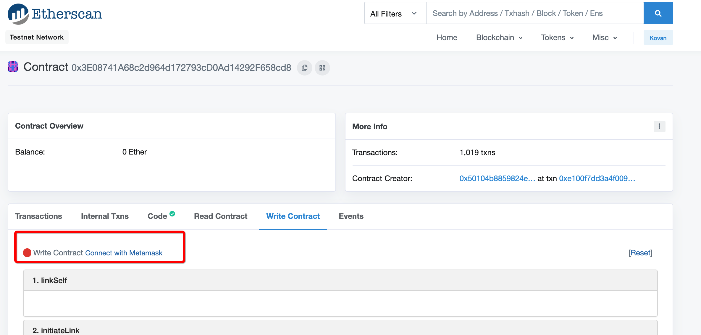
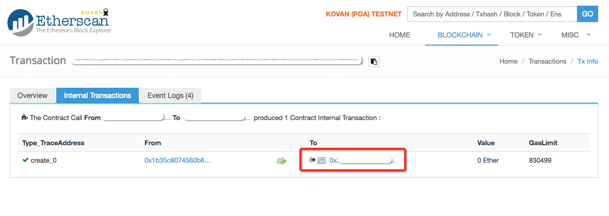
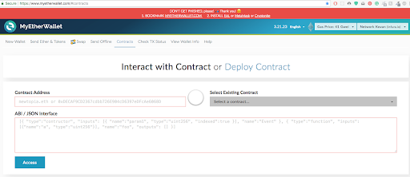
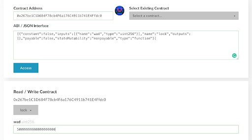
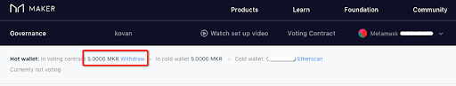

# VoteProxy Setup: Air-gapped Machine

**Level:** Intermediate  
**Estimated Time:** 60 minutes

- [VoteProxy Setup: Air-gapped Machine](#voteproxy-setup-air-gapped-machine)
  - [Overview](#overview)
  - [Learning objectives](#learning-objectives)
  - [Pre-requisites and Disclaimers](#pre-requisites-and-disclaimers)
  - [Sections](#sections)
    - [Configure geth](#configure-geth)
      - [Signing Process - example](#signing-process---example)
    - [Configure seth](#configure-seth)
    - [Initiate link](#initiate-link)
    - [Approve link](#approve-link)
    - [Approve MKR transfer](#approve-mkr-transfer)
    - [Lock MKR](#lock-mkr)
    - [Using this guide on Mainnet](#using-this-guide-on-mainnet)
  - [Summary](#summary)
  - [Additional Resources](#additional-resources)

## Overview

This guide describes one way to link an offline cold wallet to an online hot wallet for participating in MakerDAO governance by voting using the [Voting-Proxy contract](https://github.com/makerdao/vote-proxy) as described in this [article](https://blog.makerdao.com/the-makerdao-voting-proxy-contract/)

More specifically, it will show how to set up the cold-hot wallet link on your personal voting contract (VoteProxy) while your cold wallet resides on an air-gapped machine. To initiate the link, you will use [seth](https://github.com/dapphub/dapptools/tree/master/src/seth), a simple ethereum client tool in the [dapp.tools](https://dapp.tools/) collection, and geth, the go ethereum client. Geth on an air-gapped machine will be used to create and sign the transaction, but Seth on a hot machine will be used to prepare and publish the transaction. To approve the proxy link, approve MKR transfers, and lock up MKR, you will use [Etherscan](https://etherscan.io/) and [MyCrypto](https://www.mycrypto.com/). The reader needs their air-gapped machine provisioned with geth and access to their MetaMask hot wallet on another machine; it is suggested to store the cold wallet in a keystore file, accessible by geth. The following instructions work for GNU/Linux, macOS, and in a [Windows 10 bash shell](https://www.laptopmag.com/articles/use-bash-shell-windows-10).

## Learning objectives

In this guide, you will learn how to

- Set up the VoteProxy contract with an air-gapped machine
- Use geth to sign offline transactions for broadcasting

## Pre-requisites and Disclaimers

- It is assumed that you have correctly set up an air-gapped computer. Do not use these instructions if you have any concerns regarding the security of your machine.
- It is assumed that you broadcast signed transaction immediately after transaction fabrication. Especially near/after hard forks, it is suggested to research methods of replay protection if signed transactions are not immediately broadcasted. [EIP-155](https://github.com/ethereum/EIPs/blob/master/EIPS/eip-155.md) is a great starting point.

## Sections

### Configure geth

Download a standalone bundle of geth and transfer it to your air-gapped machine:
<https://github.com/ethereum/go-ethereum/wiki/Installing-Geth#download-standalone-bundle>

Confirm that your cold wallet is in a local keystore file.\
Let’s list which accounts are visible to geth.

```bash
geth account list
```

If your account is not listed, be sure to store the keystore and password file in geth’s default location, which is:

- `~/Library/Ethereum/keystore/<UTC...time.info…>--<yourPublicAddress>`
- `~/Library/Ethereum/passwords/<yourPublicAddress>.txt`

#### Signing Process - example

The following process will be employed when submitting transactions with the cold wallet. Here is a quick example of how one would approve another address for ERC20 token transfers. Note that one must include their information in every < > pair.

If geth is the only program on the air-gapped computer, then the user would need to painstakingly retype the function call data (`calldata`) and transaction hash (`tx.raw`) onto the air-gapped machine and hot machine, respectively. However, if the air-gapped computer is/can be safely provisioned with qrencode, then a QR code can be generated with the transaction hash and displayed through the CLI. With a QR code scanner, one could conveniently transfer the transaction hash to a hot machine.

1. Seth - create the data to be attached to the transaction (e.g. the method and the appropriate arguments being called). For example:

   ```bash
   seth calldata "approve(address,uint256)" <ERC20 Address> <ALLOWANCE>
   ```

   Output: `0xdaea85c50000000000000000000000008e2a84d6ade1e7fffee039a35ef5f19f13057152`

2. Geth (air-gapped machine) - from the geth console and with your unlocked wallet, create and sign a transaction with the calldata, which is shown as bytecode from seth’s output.

   ```bash
   geth --verbosity 0 --unlock <0x123ABC cold address> --password <~/path/to/passwordFile console>
   ```

   Consult <https://ethgasstation.info/> for current gas price information

   ```bash
   > var tx = eth.signTransaction({from:"<cold wallet address>", to:"<ERC20 Token Address>", gas: <gas>, gasPrice:<Wei per unit of gas>, nonce:<transaction number>, data:"<calldata output 0x12345>"}, "<cold wallet address>")
   > tx.raw
   ```

   Output: `0xf88...f1a8`

   Optional - generate a QR code and print it to the CLI

   ```bash
   echo "<tx.raw output 0x12345>" | tr -d '[:space:]' | qrencode -t ANSIUTF8
   ```

3. Seth - publish the signed transaction, which is shown as bytecode from geth’s output

   ```bash
   seth publish "<tx.raw output 0x12345>"
   ```

4. Optional - publish the QR code of the signed transaction hash through a Broadcasting tool, such as <https://etherscan.io/pushTx> or <https://www.mycrypto.com/pushTx>

### Configure seth

On another hot machine, install dapp.tools, which includes seth:

```bash
curl https://dapp.tools/install | sh
```

If install correctly, you will see:

```text
Installing dapptools ...

Installation finihsed!

You now have access to dapp, seth, solc, hevm, and ethsign.

Please open a new terminal to start using dapptools!
```

Remember to open a new terminal, as dapptools needs a fresh CLI restart.
For this tutorial, you will work with the Kovan testnet:

```bash
export SETH_CHAIN=kovan
```

### Initiate link

To initiate the link, you need to call `initateLink(hotAddress)` with our wallet on the air-gapped machine.
Make sure you have enough kovan ethereum on your cold wallet to cover gas costs. [You can get kovan ETH here](https://github.com/kovan-testnet/faucet).

Following the Signing Process outlined over in the Configure geth section

1. Seth - hot machine

   ```bash
   HOTADDRESS=<address of one of your MetaMask wallets>
   seth calldata "initiateLink(address)" $HOTADDRESS
   ```

2. Geth console - airgapped machine

   ```bash
   $ geth --verbosity 0 --unlock <0x123ABC cold address> --password ~/Library/Ethereum/passwords/<yourColdPublicAddress>.txt console
   > KPROXYFACTORY="0x3E08741A68c2d964d172793cD0Ad14292F658cd8"
   > GAS=75000
   > GASPRICE=10000000000
   > YOURADDRESS="<your cold wallet address>"
   > CALLDATA="<output from seth calldata>"
   > var tx = eth.signTransaction({from:YOURADDRESS, to:KPROXYFACTORY, gas:GAS, gasPrice:GASPRICE, nonce:1, data:CALLDATA},YOURADDRESS)
   > tx.raw
   ```

   Optional QR code generation (in another tab)

   ```bash
   echo "<tx.raw output 0x12345>" | tr -d '[:space:]' | qrencode -t ANSIUTF8
   ```

3. Seth - hot machine

   ```bash
   seth publish "<tx.raw output 0x12345>"
   ```

4. Optional - publish the QR code of the signed transaction hash through a Broadcasting tool, such as <https://etherscan.io/pushTx> or <https://www.mycrypto.com/pushTx>

### Approve link

To approve the link, you need to call `approveLink(coldAddress)` with our MetaMask wallet. To mitigate the risks in moving multiple private keys at once, you will use etherscan.io to call this smart contract function.

Now, let’s head over to the `Write Contract` tab under the Kovan etherscan Address page for the [VoteProxyFactory](https://kovan.etherscan.io/address/0x3e08741a68c2d964d172793cd0ad14292f658cd8#writeContract)

Select `Connect with MetaMask`:



Below, you’ll be able to select the `approveLink()` method.

After selection, include your cold wallet address in the argument field and submit the transaction with the default transaction settings and your MetaMask hot wallet.

If the transaction went through without any reverts, great! Your link is now approved. Next, let’s lock up some MKR to be used in Executive/Governance voting.

Note: Every cold-hot wallet link is one to one, meaning for any approved link, there is one unique cold wallet for another unique hot wallet. If you’d like to break a link, you could use either address to call the public `breakLink()` function in the VoteProxyFactory contract.

### Approve MKR transfer

Before you can lock up MKR, you need to approve our VoteProxy to make ERC20 Token (MKR) transfers. That way MKR can be pulled from the cold wallet and pushed to the voting contract (DSChief). Feel free to change the allowance to a value more appropriate for your case.

- Allowance: 100000 MKR
- Gas price: 10 Gwei
- Gas: 75000

The approve(address, uint256) method requires us to provide the amount argument in hex, denominated in WEI. Fortunately, seth has a number of simple conversion commands that will allow you to easily convert the amount in ether to wei and then to uint256:

```bash
$ seth --to-uint256 $(seth --to-wei 100000 ether)

00000000000000000000000000000000000000000000152d02c7e14af6800000
```

You’ll also need the address of your VoteProxy. This can be found via [kovan.etherscan.io](kovan.etherscan.io) and under the internal transactions tab of your previous transaction (the one used to approve the cold-hot link).



Let’s set up and approve the Voting Proxy contract that you made in the previous step.
If your cold wallet is locked, refer to the Configure Geth section when unlocking your account.

Following the Signing Process outlined over in the Configure geth section

1. Seth - hot machine

   ```bash
   ALLOWANCE=$(seth --to-uint256 $(seth --to-wei 100000 ether))
   KVOTEPROXY=< your VoteProxy address >
   seth calldata "approve(address,uint256)" $KVOTEPROXY $ALLOWANCE
   ```

2. Geth console - airgapped machine

   ```bash
   $ geth --verbosity 0 --unlock <0x123ABC cold address> --password ~/Library/Ethereum/passwords/<yourColdPublicAddress>.txt console
   > KMKR="0xAaF64BFCC32d0F15873a02163e7E500671a4ffcD"
   > GAS=75000
   > GASPRICE=10000000000
   > YOURADDRESS="<your cold wallet address>"
   > CALLDATA="<output from seth calldata>"
   > var tx = eth.signTransaction({from:YOURADDRESS, to:KMKR, gas:GAS, gasPrice:GASPRICE, nonce:2, data:CALLDATA},YOURADDRESS)
   > tx.raw
   ```

   Optional QR code generation (in another tab)

   ```bash
   echo "<tx.raw output 0x12345>" | tr -d '[:space:]' | qrencode -t ANSIUTF8
   ```

3. Seth - hot machine

   ```bash
   seth publish "<tx.raw output 0x12345>"
   ```

4. Optional - publish the QR code of the signed transaction hash through a Broadcasting tool, such as <https://etherscan.io/pushTx> or <https://www.mycrypto.com/pushTx>

### Lock MKR

With both the proxy link and MKR transfer approved, the hot wallet can be used to move MKR to and from DSChief. To call the `lock()` method on your VoteProxy contract, you will use MyCrypto, though the method can be called with your cold wallet as well. You are using MyCrypto instead of Etherscan because the former allows us to pass in your own ABI Interface sections on the fly. The lock method will pull MKR from your cold wallet and push it to DSChief. In this example, you will lock 5 MKR. Note that the MKR amount has to be represented in units of WEI.

<https://www.mycrypto.com/contracts/interact>



Input the kovan vote-proxy contract and `lock()` ABI as follows:

- Contract address:
  - `< your VoteProxy address >`
- ABI / JSON Interface:
  - `[{"constant":false,"inputs":[{"name":"wad","type":"uint256"}],"name":"lock","outputs":[],"payable":false,"stateMutability":"nonpayable","type":"function"}]`

Confirm you are on the kovan network (top right of screen), and click `Access` (bottom left).
Below, you’ll be able to select the `lock()` method.



After selection, include the number of MKR you wish to lock in the parameter field; remember that it needs to be expressed in WEI. Submit the transaction with the default settings and your MetaMask hot wallet.

If the transaction went through without any reverts, great!

When ready, head over to <https://vote.makerdao.com> with your MetaMask hotwallet. At the top of the screen, you should see your MKR locked up and cold wallet linked.



For instructions on how to vote, and finding your way around the rest of the dashboard, please click [here](https://medium.com/makerdao/introducing-the-governance-voting-ui-for-the-maker-foundational-vote-3fa669551ce1).

### Using this guide on Mainnet

If you wish to work with mainnet, you would need to go through the guide again with a couple different arguments -- set the chain to mainnet, change the gas price to be consistent with the present average gas/txn, and use all mainnet addresses:

```bash
export SETH_CHAIN=ethlive

GAS=<insert competitive gas price>

PROXYFACTORY=0xa63E145309cadaa6A903a19993868Ef7E85058BE
```

## Summary

In this guide, you signed transactions on your air-gapped machine, initiated and approved a cold-hot wallet link, approved an MKR transfer, and locked MKR in DSChief. You can now participate in Polling and Executive Voting at the Governance dapp at <https://vote.makerdao.com>

If you have any questions, you can reach out in the #dev channel on chat.makerdao.com.

Happy voting!

## Additional Resources

- [DSChief](https://github.com/dapphub/ds-chief)
- [VoteProxy](https://github.com/makerdao/vote-proxy)
