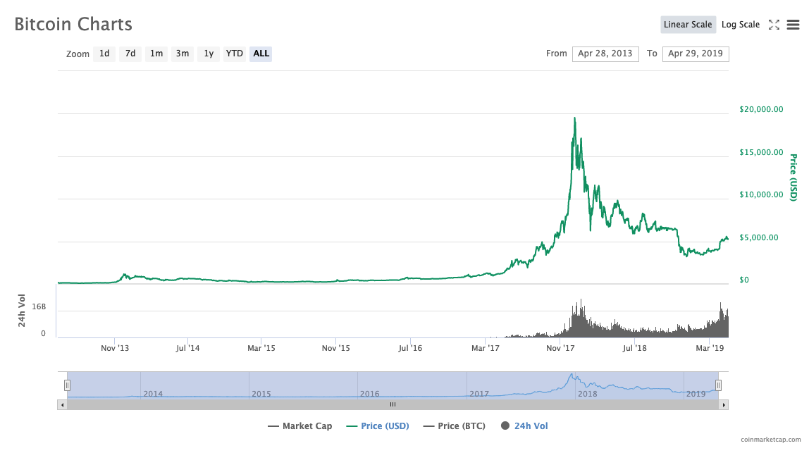
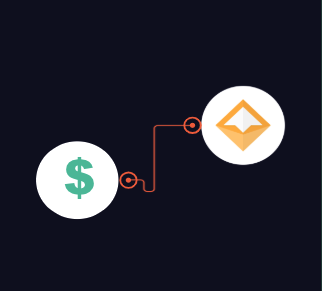
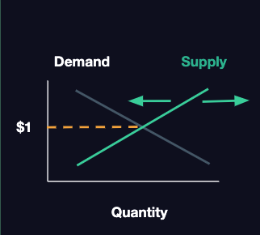
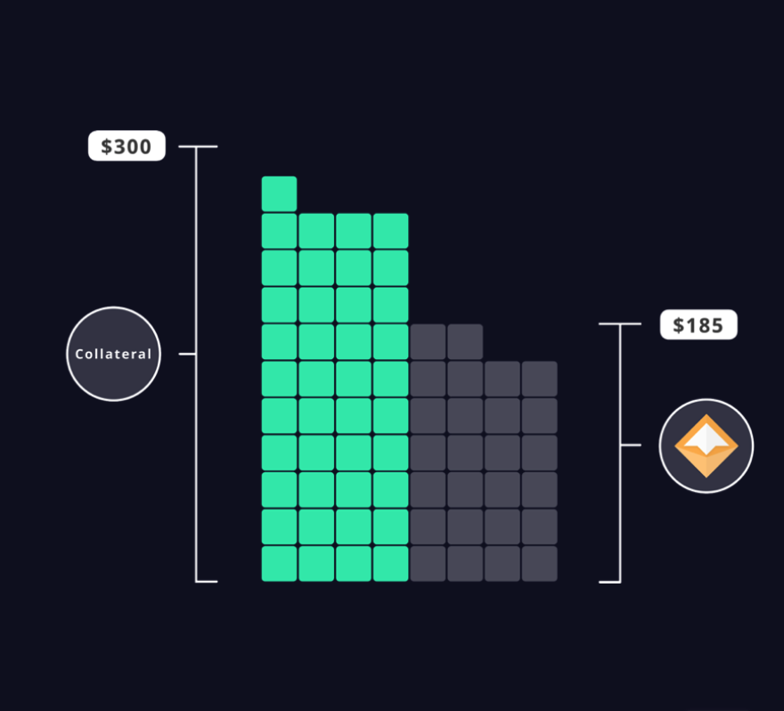
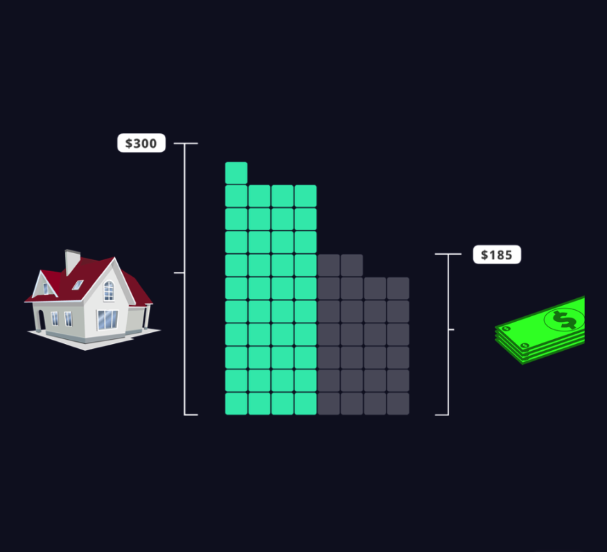
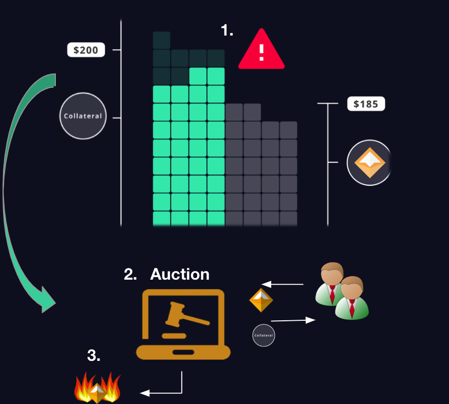
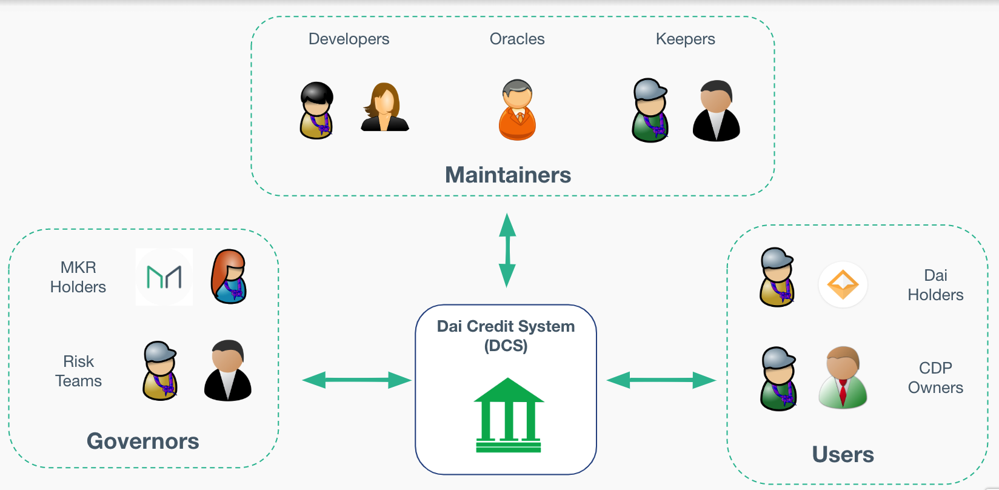

# MCD 101

A comprehensive overview of the smart contracts within the Dai Credit System.

### Sections
1. [Problem and Solution](#problem-and-solution)
2. [Dai and CDP Mechanisms](#dai-and-cdp-mechanisms)
3. [Smart Contract Modules](#smart-contract-modules)
4. [Advanced Concepts](#advanced-concepts)

## Problem and Solution
The ultimate guage of capital is denominated in the Global Currency, which is US Dollars (USD).

Is Bitcoin stable relative to the Global Currency?

**Problem**: No, bitcoin, ethereum, and other cryptocurrencies are not stable relative to the USD.

**Solution**: Dai

### MakerDAO's Flapship Product

Dai Stablecoin
* 1 Dai ~= 1 USD
* Basic user
* Fully backed by Collateral

 
 

## Dai and CDP mechanisms

### Economics

**How does it keep its peg?**

* Demand curve can shift due to market conditions, confidence of Dai holders, etc

* Supply curve is shifted through a permissionless credit factory on Ethereum

* Any actor can vary the supply of Dai through a Collateralized Debt Position (CDP)

* The system was built so that these actors are incentivized to shift the supply curve to ensure that the price is $1

 
 

### CDP

**Collateralized Debt Position (CDP)**

  * Borrow Dai through locking up cryptoassets as collateral

  * Repay Dai + fee to retrieve collateral

  * Safe, over-collateralized CDP >

 
 
 
 
 
 

**Analogous to a Mortgage**

* Bank gives you a loan by “locking” ownership rights with them

* Repay debt + interest to “free” the bank’s ownership of the house

 
 
 
 

**Liquidations**

1. CDP is automatically liquidated if the collateral value (in USD) falls too low

2. Part of the collateral is auctioned off to cover the outstanding debt + penalty fee

3. Dai is then burned to decrease the supply

  CDP owner receives the leftover collateral

 
 
 

### System Interaction Diagram

#### Users
* Dai Holders
  * Basic - No additional knowledge to own Dai
  * Stability Seekers; Consumer; Businesses
* CDP Owners
  * Intermediate - Some knowledge
  * Risk Seekers; Speculators; Borrowers

#### Maintainers
* Developers
  * Advanced - Extensive knowledge
  * Supports system upgrades accepted by Governors
* Oracles
	* Intermediate User - Some knowledge
	*	Supports data feed from real world to blockchain
* Keepers
  * Advanced User - Extensive knowledge
  * Builds/maintains systems that profit off system discrepancies and participate in DCS auctions

#### Governors
* MKR Holders
  * Advanced - Extensive knowledge
  * Monitor, partake, and vote on upgrades/changes in DCS
* Risk Teams
  * Advanced - Extensive knowledge
  * Collect/compile relevant data and develop risk models, assessed by MKR Holders

[NOTE]
====
Anyone with the required knowledge can freely participate in any role
====

> **Any one person (or service) can have multiple roles**

> Any one person (or service) can have multiple roles

**Any one person (or service) can have multiple roles**

## Smart Contract Modules

## Advanced Concepts
