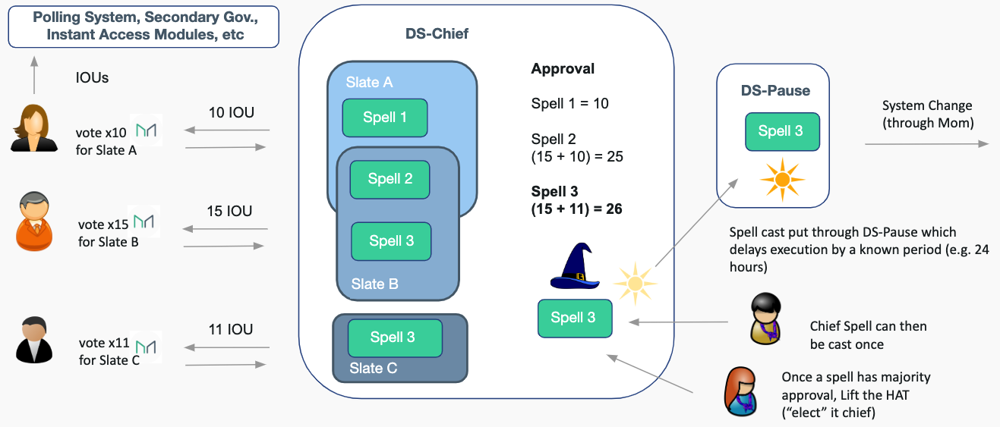

# MCD 101

A comprehensive overview of the smart contracts within the Dai Credit System.

### Sections
1. [Problem and Solution](#problem-and-solution)
2. [Dai and CDP Mechanisms](#dai-and-cdp-mechanisms)
3. [Sai vs Dai](#sai-vs-dai)
4. [Quick Vocabulary](#quick-vocabulary---general)
5. [Smart Contract Modules](#smart-contract-modules)
6. [Advanced Concepts](#advanced-concepts)

## Problem and Solution
The ultimate guage of capital is denominated in the Global Currency, which is US Dollars (USD).

Is Bitcoin stable relative to the Global Currency?

  

**Problem**: No, bitcoin, ethereum, and other cryptocurrencies are not stable relative to the USD.

**Solution**: Dai

### MakerDAO's Flapship Product

Dai Stablecoin
* 1 Dai ~= 1 USD
* Basic user
* Fully backed by Collateral

 
 

## Dai and CDP mechanisms

### Economics

**How does it keep its peg?**

* Demand curve can shift due to market conditions, confidence of Dai holders, etc

* Supply curve is shifted through a permissionless credit factory on Ethereum

* Any actor can vary the supply of Dai through a Collateralized Debt Position (CDP)

* The system was built so that these actors are incentivized to shift the supply curve to ensure that the price is $1

 
 

### CDP

**Collateralized Debt Position (CDP)**

  * Borrow Dai through locking up cryptoassets as collateral

  * Repay Dai + fee to retrieve collateral

  * Safe, over-collateralized CDP >

 
 
 
 
 
 

**Analogous to a Mortgage**

* Bank gives you a loan by “locking” ownership rights with them

* Repay debt + interest to “free” the bank’s ownership of the house

 
 
 
 
 
 
 

**Liquidations**

1. CDP is automatically liquidated if the collateral value (in USD) falls too low

2. Part of the collateral is auctioned off to cover the outstanding debt + penalty fee

3. Dai is then burned to decrease the supply

  CDP owner receives the leftover collateral

 
 
 

### System Interaction Diagram

#### Users

| Name        |  Type | Description |
| ----------- | ----------- | --------- |
| Dai Holders | Basic - No additional knowledge to own Dai | Stability Seekers; Consumer; Businesses|
| CDP Owners  | Intermediate - Some knowledge | Risk Seekers; Speculators; Borrowers|
 

#### Maintainers

| Name        |  Type | Description |
| ----------- | ----------- | --------- |
| Developers | Advanced - Extensive knowledge | Supports system upgrades accepted by Governors|
| Oracles  | Intermediate - Some knowledge | Supports data feed from real world to blockchain|
| Keepers | Advanced - Extensive knowledge | Builds/maintains systems that profit off system discrepancies and participate in DCS auctions |
 

#### Governors

| Name        |  Type | Description |
| ----------- | ----------- | --------- |
| MKR Holders | Advanced - Extensive knowledge | Monitor, partake, and vote on upgrades/changes in DCS|
| Risk Teams | Advanced - Extensive knowledge | Collect/compile relevant data and develop risk models, assessed by MKR Holders|
 

**Anyone with the required knowledge can freely participate in any role**

**Any one person (or service) can have multiple roles**

 

### System Lines of Defense

At any point, the system must have more value in collateral than value of Dai supply. The following mechanisms help maintain system solvency:

1. **Supply and Demand** - supply and demand of CDPs (and thus Dai) is influenced by the Stability Fees and Debt Ceiling adjustments

2. **Liquidation** - any time the collateral value of a CDP gets closer to its debt, it becomes “risky-er”. The system liquidates CDPs that get too risky

3. **MKR Minting/Burning** - Incentivized to Govern prudently, MKR Holders are rewarded from MKR burning when Stability Fees are paid. However, if the DCS accrues too much bad debt, MKR is minted to cover the deficit.

4. **Emergency Shutdown** - This is a process that is used as a last resort in cases of extreme market irrationality, attacks, or coordinated upgrades. Emergency Shutdown gracefully settles the Maker Platform while ensuring that all users, both Dai holders and CDP users, receive the net value of assets they are entitled to.

 
 
 
 

## Sai vs Dai

| Single Collateral Dai        |  Multi Collateral Dai |
| ----------- | ----------- |
| Single collateral type backing Dai | Multi. collateral types backing Dai |
| Less diversified | Collateral can be many assets |
| Liquidations occur at a fixed discount to the current collateral price | Liquidations are handled using Auctions|
| MKR used to pay stability fee | Dai used to pay stability fee |
| Decentralized governance through MKR voting rights| Decentralized governance through MKR voting rights|
| ----- |  More diversified and stable |

 
 

## Quick Vocabulary - General

**Risk Parameters** - system variables adjusted through MKR governance to control various types of risk.
Important parameters for each collateral type:
* **Stability fee** - a fee that continuously accrues on debt in a CDP (e.g. 0.5% per year)
* **Debt ceiling** - max amount of Dai minted for a given collateral type (e.g. 10 million Dai)
* **Liquidation ratio** - required amount of collateral as a proportion of a CDP’s total debt (e.g. 150%)

`ilk` - collateral type; each has their own set of risk parameters  
`urn` - collateralized debt position; a CDP owner can control one urn per collateral type  
`gem` - unlocked collateral; gem is collateral that is not yet locked in a CDP but still recorded in the system  
`sin` - system debt unit; a debt token that is tracked during liquidation process  
`dai` - stablecoin; a good debt token
 
 
 

### Quick Vocabulary - Rates

* **Risk Premium Rate** - This rate is used to calculate the risk premium fee that accrues on debt in a CDP. A unique Risk Premium Rate is assigned to each collateral type.  (e.g. 2.5%/year for Collateral A, 3.5%/year for Collateral B, etc)  
* **Base Rate** - This rate is used to calculate the base fee that accrues on debt in a CDP. A system wide Base Rate is assigned to all collateral types. (e.g. 0.5%/year for the Dai Credit System)  
* **Stability Rate** = _Risk Premium Rate + Base Rate_. This rate is used to calculate the **Stability Fee**.  
* **Savings Rate** - This rate is used to calculate the interest that accrues on Savings Dai. A system wide Savings Rate is assigned to all Savings Dai. (e.g. 1%/year for Savings Dai)

**All rates accrue regularly on a per second basis.**
 
 
 

### Motivations on Concise Jargon

* **To sidestep terminological debates** - for example, whether to say rate of target price change or target rate  
* **To decouple financial and technical vocabularies** - we can more flexibly improve one without affecting the other.  
* **To discuss the system formally** - this ability, with the financial interpretation partly suspended, has suggested insights that would have been harder to think of inside the normal language.  
* **To better formalize the implementation** - the precise and distinctive language makes the structure and logic of the implementation more apparent and easier to formalize.  
* **To decrease verbosity** - concise names make the code less verbose and the concepts easier to handle on paper, whiteboard, etc.

 
 
 

## Smart Contract Modules

 
***

#### Core Module
The core module contains the state of the Dai Credit System (DCS) and its central mechanisms while in normal operation.

Components - `Vat`, `Cat`, `Spotter`

What are the components?
* `Vat` - **The single source of truth for the Dai Credit System.** It contains the accounting system of the core CDP, Internal Dai balances, and collateral state. The Vat has no external dependencies and maintains the central "Accounting Invariants" of Dai. It houses the public interface for CDP management, allowing urn (cdp) owners to adjust their CDP state balances. It also contains the public interface for CDP fungibility, allowing urn (cdp) owners to transfer, split, and merge CDPs. Excluding these interfaces, the Vat is accessed through trusted smart contract modules.
* `Cat` - Public interface for **confiscating unsafe urns (cdps)** and processing seized collateral via their respective flip (collateral) auction.
* `Spotter` - Allows external actors to update the price feed in Vat for a given Ilk (collateral type).

Why do we have them?

* `Vat` - def. “a large tank or tub used to hold liquid”

  **The Vat holds the fundamental primitives of the Dai Credit System:**
  * Database - Risk parameters as well as Dai, Sin, collateral, and debt balances
  * Accounting System - Basic accounting operations to update the Database
  * CDP Management - Adjustment of locked collateral and debt position (Dai creation)
  * CDP Fungibility - Ability to transfer, split and merge CDPs

  The Vat and these primitives are designed to be non-upgradable or replaceable.  
  Other components of the system, such as auctions, oracles, and rate accumulators, are subject to future development. Their business logic has been contained within their own smart contract modules as an upgradable interface between the user and the Vat. Since these subsystems have access to more complex operations within the Vat, module upgrades are voted in by MKR holders. Through CDP management/fungibility, direct access to the Vat provides a strong guarantee to users that the basic semantics/interface aren’t going to change.  
  https://github.com/makerdao/dss/wiki/Vat

* `Cat` - def. “A domesticated, carnivorous mammal”

  **The Cat “bites” CDPs that are too risky.**  
  The minter of Dai is a CDP owner and the “borrower”, while the smart contract system is the “lender”. To increase the borrower’s confidence in the minted value lent out, the lender requires all minted Dai to be fully backed by an asset with value that is proven in free markets. If the value of the underlying asset dips below the required amount, the collateralization ratio (USD value of asset / USD value of Dai debt) decreases. To increase this ratio and prevent insolvency of the system, the lender takes (via Cat) the collateral and sells it for Dai in an auction (Flipper).  
  Remember: 1 Dai must always be backed by more than 1 USD worth of assets.  
  https://github.com/makerdao/dss/wiki/Cat

* `Spotter` - def. “an aviator or aircraft employed in locating or observing enemy positions”  

  The Dai Credit System requires real time information about the market price of the assets used as collateral in CDPs. Ultimately, this market price determines the amount of Dai that can be minted, as well as the grab condition for CDP liquidations. The oracle module handles how markets prices are recorded on the blockchain.  

  The Spotter is simply **an interface contract** where external actors pull the **current market price** from the Oracle module for the **specified collateral type**. The Vat reads the market price from the spotter.  
  https://github.com/makerdao/dss/wiki/Spot

***

#### Collateral Module
The collateral module is deployed for every new ilk (collateral type) added to Vat. It contains all adapters and auction contract for one collateral type. All token behavior is abstracted behind these adapters.

Components - `Join`, `Flipper`

What are these components?

  * `Join` - The Join adapter is **used to deposit unlocked collateral** into the Vat. Currently, GemJoin is only compatible with standard ERC20 tokens, but eventually there will be various types of Join adapters that are compatible with different Token Standards.
  * `Flipper` - **Gem auction house**. Each gem/flip auction is unique and linked to a previously bitten urn (cdp). Investors bid with increasing amounts of DAI for a fixed GEM amount. When the DAI balance deficit is covered, bidders continue to bid for a decreasing gem size until the auction is complete. Remaining GEM is returned to the CDP owner.

Why do we have them?

* `Join` - def. of Gem - “a precious or semiprecious stone”  
  To retain the security of the system, only trusted smart contracts can interact with the Vat. A Join adapter is a trusted smart contract that is used to **deposit unlocked collateral** within the Vat. The location of collateral deposited/locked in CDPs is in the the appropriate Join adapter.
  https://github.com/makerdao/dss/wiki/Gem

* `Flipper` - def. of Flip - “turn over or cause to turn over with a sudden sharp movement.”  
  The purpose of the gem auction house is to decrease the market risk of collateral backing Dai. It sells an amount of seized gem to **purchase and burn Dai**, which will **increase the collateralization ratio** of the system, away from insolvency. https://github.com/makerdao/dss/wiki/Fuss
   
  Priorities for the Flipper:
  * Cover the amount of total debt (minted Dai + accrued fees) of the CDP
  * Return as much collateral back to the CDP owner as possible

***

#### Dai Module
_Fundamentally, "Dai" is any token that is directly fungible with the core collateral._  
The dai module contains the dai token representation and all adapters thereof.

Components - `Dai`, `DaiJoin`

What are these components?

* `Dai` - An extension to the standard ERC20 token interface. Contains the database of Dai token owners, transfer and supply logic.

* `DaiJoin` - DaiJoin is an adapter where all Dai tokens are created. The CDP owner interacts with DaiJoin to mint the Dai tokens that has been allocated for them in the Vat as well as burn Dai Tokens + fees accrued against their CDP.

Why do we have them?

* `Dai` is an extension of DS-Token, which is part of DappSys, a safe, simple, flexible library for smart-contract systems.  

  DSToken is an implementation that supports the ERC20 Standard, but with a few additions that complement the design of the Dai Credit System:
  * _Addition of mint and burn functions (with proper authorization)_ -> to control token supply  
  * _Push, pull and move aliases for transferFrom operations_ -> improves readability  
  * _Binary allowance approval_ -> lower gas and higher security  

* `DaiJoin`  
  To retain the security of the system, only trusted smart contracts can interact with the Vat. DaiJoin is a trusted smart contract that is used to deposit Dai into the Vat. **All minting and burning of Dai tokens happens in DaiJoin** (think “United States Mint”).
  https://github.com/makerdao/dss/wiki/Dai

***

#### System Stabilizer Module
When the value of the collateral backing Dai drops below the liquidation level, then the stability of the system is at risk. The System stabilizer module sets up incentives for Keepers (incentivized external actors) to step in, push the system back to a safe state, and earn profits.

Components - `Vow`, `Flopper`, `Flapper`

What are these components?

* `Vow` - The Vow represents the **DCS’s balance**, as the recipient of both system surplus and system debt. Its function is to cover deficits via debt auctions and discharge surpluses via surplus auctions.  

* `Flopper` - Debt Auction house. Debt auctions are used to get rid of the Vow’s debt by auctioning off MKR for a fixed size of internal Dai. **Bidders compete with decreasing “amount requests” of MKR**. After auction settlement, the Flopper sends the received internal Dai to the Vow to cancel out its debt. The Flopper mints the MKR for the winning bidder.  

* `Flapper` - Surplus Auction house. Surplus auctions are used to get rid of the Vow’s surplus by auctioning off a fixed size of internal Dai for MKR. **Bidders compete with increasing amounts of MKR**. After auction settlement, the Flapper burns the winning MKR bid and sends the internal Dai to the winning bidder. For this reason, surplus auctions are **also known as Buy & Burn auctions**   

Why do we have them?

* `Vow` - def. “a solemn promise.”

  The Dai Credit System deviates from equilibrium when it receives system debt and system surplus through collateral auctions and CDP stability fee accumulation, respectively. The Vow houses the business logic to kick off debt and surplus auctions, which correct the system’s monetary imbalances.

  System debt: **When CDPs are bitten**, their debt is taken on by the Vow as Sin, the system debt unit, and placed in the Sin queue. If this Sin is not covered by a flip auction within some wait time, the Sin “matures” and is now considered bad debt to the Vow. This bad debt can be covered through a debt auction when it amounts to its lot size.  

  System surplus: **Stability fee accumulation** occurs in the form of additional internal Dai to the Vow. This surplus is then discharged through surplus auctions.
  https://github.com/makerdao/dss/wiki/Vow

* `Flopper` - def. of Flop - “be completely unsuccessful; fail totally”

  The purpose of the debt auction is to cover the system deficit, which is resembled by Sin. It sells an amount of minted MKR and purchases Dai to be canceled 1-to-1 with Sin.

  Priorities for the Flopper:
  1. Raise an amount of Dai equivalent to the amount of bad debt **as fast as possible**
  2. Minimize the amount of MKR inflation

* `Flapper` - def of Flap - “(of a bird) move (its wings) up and down when flying or preparing to fly”

  The purpose of the surplus auction is to release Dai surplus from the Vow as well as reward the MKR holders in the form of MKR deflation. It sells a fixed amount of Dai to purchase and burn MKR.

  Priorities for the Flapper: **Burn as much MKR as possible** when auctioning surplus

  https://github.com/makerdao/dss/wiki/Fuss

***

#### Oracle Module

The value of collateral in a CDP is derived from its global, free market USD price. An oracle module is deployed for each collateral type. It feeds price data for a corresponding collateral type to the Vat.  Whitelisted addresses broadcast price updates off-chain, which are fed into a medianizer before being pulled into the OSM. The Spotter reads from the OSM.

Components - `Medianizer`, `OSM`

What and why these components?

* `Medianizer` - For a specific Ilk, the Medianizer returns the median value of several price feeds, fed from the off-chain Omnia Relayer Network. A median value is determined to mitigate the variability in single data points.

* `OSM` (Oracle Security Module) - Authorized users are allowed to set a value after some duration of time (e.g. one hour). To protect the system from an attacker who gains control of a majority of the oracles, the OSM imposes a **1 hour delay on price feeds**, leaving enough time for the MKR governance community and emergency oracles to analyze the data and react.

***

#### MKR Module
The Mkr module contains the MKR token representation.

As a **utility token**: MKR is burned relative to the stability fee accrued on CDPs. This burning happens in the Flapper auction house. This deflates MKR supply and rewards holders for proper governance.  
As a **governance token**: MKR is used by MKR holders to vote for the risk management and business logic of the Dai Credit System. Tokens are a simple representation of voting power.  
As a **recapitalization resource**: MKR is minted and sold for DAI, which is used to recapitalize the Dai Credit System in times of insolvency. This minting happens in a Flopper auction house, inflates MKR supply, and penalizes holders for improper governance.

Components - `DSToken`

What and why these components?

* `DSToken` - An implementation supporting the ERC20 Standard; part of the DappSys (DS) library. Contains database of MKR owners, transfer and supply logic.

***

#### Governance Module
The Governance Module contains the contracts that facilitate MKR voting, proposal execution, and voting security of the Dai Credit System.

Components - `DS-Chief`, `DS-Spell`, `DS-Pause`

What are these components?
* `DS-Chief` - A basic voting contract that grants root access of the DCS to an elected “Chief” (address). Through [Approval Voting](https://en.wikipedia.org/wiki/Approval_voting), voters **lock up their MKR and vote** with a weight relative to the outstanding supply of MKR. Spells (proposals) are a type of Proposal Object and are submitted to DS-Chief under one of two categories:
  * Governance Proposals - Sentiment signaling on system changes
  * Executive Proposals - Execution of system changes

  Anyone can create a Spell, and MKR holders can vote on bundles of Spells, called Slates. At any point, the **Spell (proposal) with the most approval is the elected “Chief”**, has access to and can configure DCS through Mom, the Admin interface contract for Maker Governance.

* `DS-Spell` - DS-Spell is a generalized un-owned contract that performs one action, or series of atomic actions, one time only. It is a type of Proposal Object that is submitted to `DS-Chief`.

* `DS-Pause` - Similar to the OSM, DS-Pause schedules function calls that can only be executed after some predetermined delay has passed. Proposal objects are passed through `DS-Pause` after being elected "Chief".

Why do we have them?

* `DS-Chief` - def. of Chief - “a leader or ruler of a people or clan”  

  DS-Chief is the first iteration of an on-chain tool for Maker Governance. It simply allows MKR holders to vote with a weight relative to their proportional holdings. **Votes are casted towards Proposal Objects**, which are ethereum addresses that can represent:  

  * A Spell (contract with one function that does one action, one time)
  * A MegaSpell (contract with one function that does multiple actions, one time)
  * Multi-Signature Contract
  * Externally owned account, etc

  This governance mechanism employs an ACL (access control list) approach, where there is a single owner that has permission to call protected functions on Mom (Admin. interface for DCS). **At any time, this single owner is the Proposal Object that has the most votes/approval in DS-Chief**; it could change during every executive voting period, which is facilitated through off-chain coordination. Within this period, MKR holders are encouraged to vote for a Slate (bundle of Spells) that includes the previous Spell. This secures the election of the old “Chief” until enough MKR approves the new Proposal Object. In other words, this prevents the chance of an unintended Proposal Object from being elected “Chief” during the approval phase of the new Proposal Object.   https://github.com/dapphub/ds-chief

* `DS-Spell` - def. of Spell - “a form of words used as a magical charm or incantation.”  

  DS-Spell is a generalized **un-owned contract that performs one action**, or series of atomic actions, one time only. The DS-SpellBook is a DS-Spell factory contract used to create Executive Spells (proposals), which perform single, preconstructed changes to the DCS. Spells can be “casted” by anyone and if the transaction is successful (no reverts or exceptional conditions), then the **spell is marked as `done` and cannot be re-cast**.   https://github.com/dapphub/ds-spell

* `DS-Pause` - def. of Pause - “interrupt action or speech briefly.”  

  Similar to the OSM, DS-Pause **schedules function calls** that can only be executed after some predetermined delay has passed. A DS-Pause implementation for Maker Governance is used to schedule Spells after their approval in DS-Chief; e.g. all Spells are executable after 24 hours. As a security component, DS-Pause ensures that those affected by governance decisions have time to react in the case of an attack. The delay period can be adjusted through an Executive Spell and extended indefinitely for coordinated upgrades to DS-Chief.   https://github.com/dapphub/ds-pause

 

***

#### Rates Module
_Compound interest through a rate accumulation function._  
The Rates module is responsible for collecting stability fees on outstanding CDP debt and distributing interest proceeds to Savings Dai.

Components - `Jug`, `Pot`

What are these components?
* `Jug` - Contains drip( ), a **public function** used to update an Ilk debt rate for an assigned stability fee. Since a debt rate is a function of time, it should be updated via drip( ) on a regular basis. Auction keepers, MKR holders, and other relevant stakeholders are **incentivized to call Jug.drip( ) consistently**.
* `Pot` - The Pot contract is where a Dai holder would lock up Internal Dai to accrue interest at the Dai Savings Rate. Similar to Jug, this contract employs its own Drip function used to update it’s own internal rate. This rate follows the Dai Savings Rate and is used in the exchange of Savings Dai and Internal Dai. Dai holders, MKR holders, and other relevant stakeholders are **incentivized to call Pot.drip( ) consistently**.

  A portion of the Stability Fee is allocated for the Dai Savings Rate by increasing the amount of Sin in the Vow at every Pot.drip( ) call.

Why do we have them?

* `Jug` - def. “a large container for liquids”  

  Jug updates each Ilk’s (collateral type) debt unit rate while the offsetting Dai is supplied to/by the Vow. The effect of this is to **apply accumulated stability fee** to the outstanding Dai position of all CDPs. Since the Blockchain is inherently passive, it requires an external “reminder” to collect stability fees; this “reminder” is in the form of calling Drip.   https://github.com/makerdao/dss/wiki/Drip

* `Pot` - def. “a container, typically rounded or cylindrical, used for storage”
  Pot houses the implementation of Savings Dai, **a method of accruing interest on inactive Dai**. The interest rate is called the Dai Savings Rate, set by Maker Governance, and is typically less than the base stability fee to remain sustainable.
  This purpose of Pot is to offer another incentive in holding Dai.   https://github.com/makerdao/dsr

  The ‘Why’ of Rates Modules is expanded in _Section 4 - Advanced Topics and User Stories_

***

#### Proxy Module

The Proxy module is purposed to increase the usability and convenience of the DCS. It contains contract interfaces, proxies, and aliases to functions necessary for CDP management and Maker governance.  

Components - `DssCdpManager`, `VoteProxy`

What and why these components?
* `DssCdpManager` - **A wrapper for CDP numerical identification**. Once unlocked collateral is deposited into the DCS, a numerical identifier can be assigned to an owner’s CDP for a specific ilk. Next, the owner (or authorized party) can use the aliases contained in the DssCdpManager for all facets of CDP management.   https://github.com/makerdao/dss-cdp-manager

* `VoteProxy` - The VoteProxy is a contract that **facilitates online voting with offline MKR storage**. Through a personal VoteProxy, a linked hot wallet can pull and push MKR from the proxy’s corresponding cold wallet and to DS-Chief, where voting can take place with the online hot wallet.  The reason for having the voting proxy contract is two-fold: to support two different voting mechanisms and to minimize the time that MKR owners need to have their wallet online.   https://bit.ly/2GkjBXW   https://github.com/makerdao/vote-proxy

***

#### Instant Access Module

Instant Access Module houses the components to create direct, bounded changes to the Dai Credit System without consensus in DS-Chief. **NOT FINAL SPECIFICATION**

Components - `RO`, `DEO`, `CDPO`

What and why these components?

* `RO` (Rates Oracle) - Through admin access to the Rates Module, the Rates Oracle enables more dynamic updates to the Risk Premium Rates, Base Rate and Savings Rate. As a secondary governance mechanism, the Rates Oracle allows MKR holders to vote with the IUOs they receive when locking up their MKR in DS-Chief. Furthermore, to vote they have to stake some amount of Dai (e.g. $1000 or $10,000), which will be passed on to the Buffer if they vote for a losing proposal.
* `DEO` (Decentralized Emergency Oracle) - Holds admin access to shut down the Dai Credit System. As a secondary governance mechanism, the DEO allows MKR holders to stake MKR and vote for an Emergency Shutdown.
* `CDPO` (NFT/LEIN CDP Oracle) - Controlled by authorized Risk Team(s), the CDPO holds admin access to add an NFT/LIEN CDP type on the fly under certain restrictions.

***

#### Authorized Interface Module

The Authorized Interface Module holds the interfaces between the system and the governance contracts. **NOT FINAL SPECIFICATION**

Components - `Mom`, `INT-RO`, `INT-EO`, `INT-DEO`, `INT-CDPO`

What and why these components?

* `Mom` - Mom is a contract interface to adjust the risk parameters of the Dai Credit System. The chief in DS-Chief has the exclusive authority to call functions through Mom. The following contracts rely on Mom: Spotter, Cat, Vow, Vat, and Jug.
* `INT-RO` (Rates Oracle Interface) - Interface contract for the Rates Oracle. Accessible by the Rates Oracle. It has bounded authority over the Rates Module.
* `INT-EO` (Emergency Oracle Interface) - Interface contract for the Emergency Oracles. Voted in by Maker Governance, the Emergency Oracles are authorized to shut down the system.
* `INT-DEO` (Decentralized Emergency Oracle Interface) - Interface contract for the Decentralized Emergency Oracle. It is authorized to shut down the system.
* `INT-CDPO` (NFT/Lein CDP Oracle Interface) - Interface contract for the NFT/LEIN CDP Oracle. It is authorized to add NFT/LEIN CDP types to the system.

 

## Advanced Concepts

 

### System Design Considerations

* Token Agnostic
  * System is indifferent to implementation of external tokens
  * The Join **adapters abstract away the differences** between ERC 20s, Non Fungible Tokens (NFTs), invoice tokens, etc
* Verifiable
  * Designed from bottom up to be **well suited for formal verification**; every Vat state defined and proved
  * The Vat makes **no external calls**, as functions in external contracts are subject to change
  * The Vat contains **no precision loss**; it only adds, subtracts, and multiplies
* Modular and Upgradable
  * Implementations of e.g. auctions, liquidation, CDP risk conditions, and new collateral types, to be altered on a live system through Maker Governance

 

***

### Asset States within the Vat

* Unlocked Collateral - **Gem** credit within the Vat. A user can increase and decrease their allocation (on a per collateral type basis) without restriction
* Locked Collateral - A user has the freedom of choosing how much Gem they wish to expose to liquidation in their CDP. To do this, they lock their Gem credit in a CDP and draw Dai against their now encumbered collateral called **Ink**.
* Internal Dai - Dai credit within the Vat. A user can increase and decrease their allocation through the minting and burning of Dai **without restriction**

 

***

#### Why different asset states?

The reason why we have a separate unlocked collateral balance is for security.

To minimize dependencies, the system makes only two types of function calls to external smart contracts:
* TransferFrom( ) to deposit collateral
* Transfer( ) to free collateral

Once some collateral is deposited and registered as a gem balance, the system does not need to make any additional external calls to determine the token balance. **The user’s internal unlocked balance is all they have as far as the system is concerned.**

 

***

### CDP States within the Vat

Note on Step 2:  
Although Alice freed 7 eth from her unlocked balance, the CDP’s collateralization ratio is the same in step 2 and 3, since the **CDP’s debt is backed only by the amount of locked collateral.**

 

 
 
 

 
 
 

***

### Problem with Compounding Fees

The Dai Credit System needs to be able to calculate the total stability fee owed for each CDP, which depends on:

* How much Dai was borrowed
* How long the Dai has been outstanding  

The stability rate(s) while the Dai was outstanding (which can change at any time, even in the middle of an CDP’s lifetime)
**This needs to be done for all CDPs, and there could be millions of CDPs.**

 
 
 

### Solution: Rate Accumulation Function

Keeping track of compounded stability fees for all CDPs only requires storing two types of abstract variables:  
* 1 variable per CDP, **(urn.art)**, adjusted by the user
* 1 global variable for each collateral type, **(ilk.rate)**, updated by calling Drip

Calculating the total debt owed (drawn dai + stability fee accrued) for a given CDP only requires multiplying these two variables together, regardless of changes in stability rates.

The Total Debt is not stored in the codebase. Instead, when it is needed, the below calculation is performed with the urn’s unique **art** and the **rate** for an individual collateral type. A common rate, used among urns of the same collateral type, sidesteps the problem of looping across all urns to update their Total Debt.

  

|  |  urn.art | ilk.rate |
| ----------- | ----------- | --------- |
| What? | Abstract variable for an urn. It is equivalent to the urn’s total debt when rate equals 1. | Abstract variable for an Ilk. When a new collateral type is added to the Vat, it is set to 1. It is a function of stability rate and time.|
| How is it updated? | It is adjusted when Debt is drawn/wiped by the urn owner. | Every time Drip is called.|
| Notes | The user must have unlocked/locked collateral (urn.ink) in the Vat to increment/decrement art| As long as the stability fee is positive, Ilk.rate will increase indefinitely |
| Equation |  |  |

  *What* - Abstract variable for an urn. It is equivalent to the urn’s total debt when rate equals 1.  
  *How is it updated?* - It is adjusted when Debt is drawn/wiped by the urn owner.  
  *Notes* - The user must have unlocked/locked collateral (urn.ink) in the Vat to increment/decrement art 
  

  *What* - Abstract variable for an urn. It is equivalent to the urn’s total debt when rate equals 1.  
  *How is it updated?* - It is adjusted when Debt is drawn/wiped by the urn owner.  
  *Notes* - The user must have unlocked/locked collateral (urn.ink) in the Vat to increment/decrement art 
  

