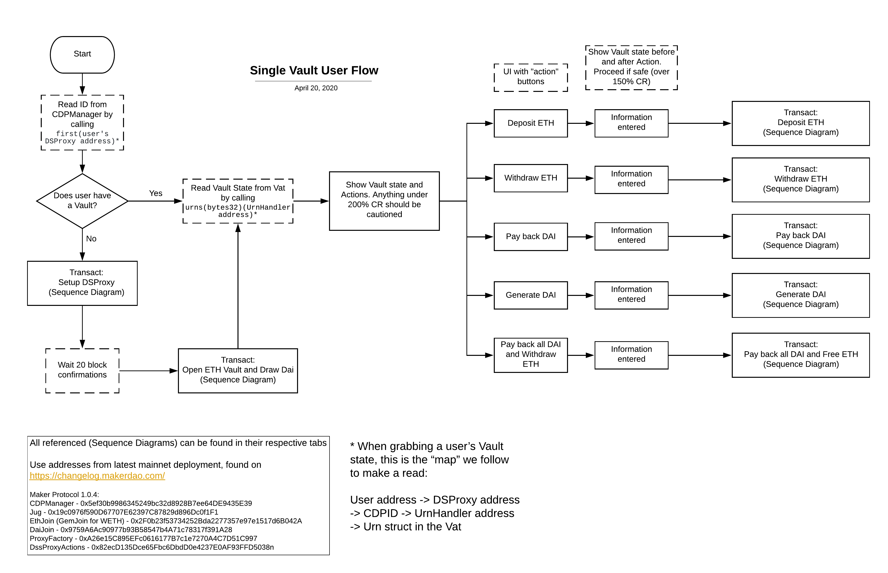

# Maker Vault Integration Guide

**Level**: Intermediate

**Estimated Time**: 90 - 120 minutes

- [Maker Vault Integration Guide](#maker-vault-integration-guide)
  - [Overview](#overview)
  - [Learning Objectives](#learning-objectives)
  - [Pre-requisites](#pre-requisites)
  - [Guide](#guide)
    - [Vault Integration](#vault-integration)
      - [Vault Lifecycle](#vault-lifecycle)
        - [Open](#open)
        - [Manage](#manage)
        - [Close](#close)
      - [Integration Tools](#integration-tools)
        - [Vault Manager](#vault-manager)
        - [Dai.js](#daijs)
          - [MCD Dai.js Example](#mcd-daijs-example)
        - [Pymaker](#pymaker)
    - [Vault Management](#vault-management)
      - [Ownership](#ownership)
      - [Adjustment](#adjustment)
      - [Accounting](#accounting)
        - [Individual Vaults](#individual-vaults)
        - [Shared Vaults](#shared-vaults)
      - [Monitoring](#monitoring)
      - [Liquidation Support](#liquidation-support)
    - [Vault Packaging](#vault-packaging)
      - [Components](#components)
        - [Exchanges](#exchanges)
        - [Lending protocols](#lending-protocols)
    - [Accepted Vault Collateral Types](#accepted-vault-collateral-types)
  - [Integration Stories](#integration-stories)
    - [Centralized Exchange](#centralized-exchange)
  - [Summary](#summary)
  - [Additional resources](#additional-resources)
  - [Next Steps](#next-steps)
  - [Help](#help)

## Overview

Vaults can accept a wide variety of tokenized collateral, representing both crypto and real world assets, and give users the ability to borrow Dai against this pledged collateral. Custom Vault portals can leverage this versatility along with the open developer platform to make it easier for users to better manage their vaults and can also go further and package vaults with other financial components to build products tailored for their needs.

## Learning Objectives

After going through this guide you will get a better understanding of,

- Vault Integration SDKs
- Vault management for different user types
- Vault packaging with other financial components

## Pre-requisites

You will need a good understanding of these concepts to be able to work through this guide,

- [MCD 101](https://github.com/makerdao/developerguides/blob/master/mcd/mcd-101/mcd-101.md), especially:
  - Vault basics.
  - Governance Risk parameters.

## Guide

Vaults are designed to give users easy and permissionless access to generate their own Dai with features such as no fixed term limits, per second interest compounding, and up to 45 decimals of precision when accounting for debt. As a developer building a custom Vault integration, you can go beyond building a simple Vault portal that exposes basic Vault options to users and differentiate your offering with additional features around two dimensions--- Vault management and packaging.

Some examples of portals that have built custom Vault integrations,

- Using proxy contracts for Vault management, [InstaDapp](https://instadapp.io/) integrates with liquidity sources like Kyber Network to help users pay stability fees with any currency they want, maybe ETH. InstaDapp also packages Vaults with Compound (another lending protocol) to create a bridge that allows users to migrate their Vault between Compound and the Maker protocol to access competitive rates.
- [DefiSaver](https://defisaver.com/) packages Vaults with ETH/DAI liquidity from the [OasisDEX](https://oasis.app/trade/) to allow owners to self-liquidate their Vault before incurring a liquidation penalty from the protocol.
- [Keydonix](https://liquid-long.keydonix.com/) packages Vaults with their internal ETH liquidity along with the OasisDEX to create ETH margin long positions in a single iteration.
- [Centrifuge](https://centrifuge.io/)'s Tinlake allows users to borrow Dai by locking NFTs on their lending platform which packages Vaults on their backend.


*Illustration of a Vault packaged with various components:*

The possibilities to both differentiate and serve users are endless, and we will outline some general principles to help you architect and develop your custom Vault integration in the following sections of this guide,

- Vault integration: Lifecycle and Integration SDKs
- Vault management strategies for various user types
- Vault packaging with other financial components
- Examples

### Vault Integration

#### Vault Lifecycle

Every Vault in the system goes through these stages in its lifecycle.

##### Open

Users lock the tokens they own from any of the accepted collateral types into a Vault. A Vault will stay safe as long as its Dai debt remains below the limit set in the system through the liquidation ratio. Ex: Ether's collateralization ratio is 150% and currently trades at 100 USD. A user is allowed to generate a maximum of 66.66 DAI for every ETH locked. Users continue to own the collateral they have locked in a Vault and accrue gains or losses by staying invested in the asset. They are also able to use the generated Dai to purchase other assets they desire from various exchanges or merchants.

##### Manage

Once it is open, it is now the user's responsibility to ensure the Vault remains safe even when the price of the locked underlying collateral fluctuates. Users will know the future price that will be used to revalue their Vault up to an hour in advance. If the value of the collateral goes down, users can take action by either locking additional collateral or reducing debt (by paying back) to keep the Vault safe.

##### Close

Users can close their own Vaults anytime by paying off the debt recorded in it with Dai which is a sum of Dai directly borrowed by the user and accrued stability fees that the system increases continuously as additional debt on the Vault.

A Vault becomes unsafe when its total debt becomes greater than the required minimum collalteralization ratio. When this happens, the system cancels the accrued debt and liquidates the Vault. It adds a liquidation penalty on the Vault and then auctions the locked collateral to raise the Dai required to cancel the debt before returning any remaining collateral back to the Vault owner.

#### Integration Tools

There are multiple ways to integrate with the Maker products: Smart contracts, Dai.js JavaScript SDK, and the [pymaker](https://github.com/makerdao/pymaker) Python SDK. The choice of which tool to choose relies mostly on your in house design philosophy, software architecture and tools arsenal.

We can recommend one tool over another according to our experience, however you or your software architect would have a better understanding of what could be used in your system.

##### [Vault Manager](https://github.com/makerdao/dss-cdp-manager)

Another way to interact with Vaults is through the Maker smart contracts.

CDP Manager is our public facing interface contract that allows anyone to easily interact with the MCD system. This is the recommended way to interact with the Maker protocol. You can find some examples that show a simple Vault lifecycle with CDP Manager [here](https://github.com/makerdao/developerguides/blob/master/mcd/mcd-seth/mcd-seth-01.md). Or dive deep in the [CDP Manager Guide](../cdp-manager-guide.md).

If you want to abstract many individual contract calls into one, then you can use our [proxy contract](https://github.com/makerdao/dss-proxy-actions) that uses the CDP Manager to interact with the system. In the proxy contract, the owner of the Vault is the proxy address and not the user's address. Clearly, the user's address is the owner of the proxy, so there's a link between the two addresses. Please refer to the [Working with DSProxy](https://github.com/makerdao/developerguides/blob/master/devtools/working-with-dsproxy/working-with-dsproxy.md) guide to understand how proxy contracts are used to interact with the core system. Here's an example of a Single Vault User Flow when using the DSProxy design pattern:



*Illustration of a Single Vault User Flow:*

Referenced sequenced diagrams of each transaction operation with DSProxy can be [found here](/vault/vault-integration-guide/sequence-diagrams/README.md).

In the example of a custodial exchange, using the CDP Manager could bring more options to operate with the MCD system on the exchange, as this allows easy control of the Vault lifecycle. The exchange can open Vaults for the users and link the Vault Id to the user Id, hence having a link to the user for accountability.

##### [Dai.js](https://docs.makerdao.com/building-on-top-of-the-maker-protocol/dai.js-wiki)

Link to documentation: [Dai.js](https://docs.makerdao.com/building-on-top-of-the-maker-protocol/dai.js-wiki)

By opting the Dai.js route, you will have a library full of ready to use features that can be plugged into your own infrastructure. This library supports both frontend and backend applications and is also used in products delivered by the Maker Foundation. It allows you to focus mostly on your product design and not much on the internal plumbing on managing a web3 instance with contract ABIs.

Nonetheless, you will have to depend on the Dai.js maintainers to build new features or update functionality when need arises.

###### MCD Dai.js Example

Currently, Dai.js has a plugin that enables interaction with the MCD deployment, the [dai-plugin-mcd](https://github.com/makerdao/dai.js/tree/dev/packages/dai-plugin-mcd). This plugin uses the DS-Proxy via the [CDP Manager](https://docs.makerdao.com/smart-contract-modules/proxy-module/cdp-manager-detailed-documentation). It can be used with the [Kovan 0.2.17](https://changelog.makerdao.com/releases/kovan/0.2.17/contracts.json) deployment or with the [mainnet deployment](https://changelog.makerdao.com/releases/mainnet/1.0.0/contracts.json).

A quick example of opening a Vault with Dai.js would look like this:
Make sure to run [node 11.10](https://nodejs.org/download/release/v11.10.0/) and follow install [instructions](https://github.com/makerdao/dai.js).  

```javascript
// Importing the necessary dependencies
import McdPlugin, { ETH, REP, MDAI } from '@makerdao/dai-plugin-mcd';
import Maker from '@makerdao/dai';

//Defining the maker object with necessary configurations
const maker = await Maker.create('http', {
privateKey: YOUR_PRIVATE_KEY,
    url: 'https://kovan.infura.io/v3/YOUR_INFURA_PROJECT_ID',
    plugins: [
        [
            McdPlugin,
            {
                network: 'kovan',
                cdpTypes: [
                    { currency: ETH, ilk: 'ETH-A' },
                    { currency: REP, ilk: 'REP-A' },
                ]
            }
        ]
    ]
});
await maker.authenticate();
await maker.service('proxy').ensureProxy();
const cdpManager = maker.service('mcd:cdpManager');
/*
Opening a Vault with the REP token as collateral.
This is done in one function call with the help of the proxy contract
In one function call, the user opens a Vault, locks 50 REP tokens and draws 70 Dai
*/
await cdpManager.openLockAndDraw('REP-A', REP(50), MDAI(70));

/*
Closing a Vault requires getting the CDP Id and passing it to the wipeAndFree()
function
*/
let proxy = await maker.currentProxy();
let cdps = await cdpManager.getCdpIds(proxy);
await cdpManager.wipendFree(cdps[0].id, 'REP-A', MDAI(70), REP(50))
```

We have some example projects that can show you how to use Dai.js:

- [Dai.js MCD Plugin Example](https://github.com/makerdao/integration-examples/tree/master/mcd-dai)
- [Governance Dashboard](https://github.com/makerdao/governance-dashboard)
- [MCD-CDP-Portal](https://github.com/makerdao/mcd-cdp-portal)

##### [Pymaker](https://github.com/makerdao/pymaker)

In order to ease Keeper development, a python API around most of the Maker contracts has been created. It can be used not only by keepers, but may also be found useful by authors of some other, unrelated utilities aiming to interact with these contracts, such as Vault interaction.

You only need to import this project as a python module if you want to utilize the API. Moreover, it offers a [transaction facility](https://github.com/makerdao/pymaker/blob/master/pymaker/__init__.py#L346), wrapped around `web3.eth.sendTransaction()`, which enables the use of [dynamic gas pricing strategies](https://github.com/makerdao/pymaker/blob/master/pymaker/gas.py).

Here's a [pymaker integration example](https://github.com/makerdao/pymaker/blob/master/tests/manual_test_mcd.py) of the full Vault Lifecycle.

### Vault Management

A Vault portal is a gateway for a user for managing a Vault. It can help them to lock collateral and open one, hold custody over it if required, provide monitoring and notification support for important changes that could affect its safety, and provide options to adjust collateral or debt either automatically or with user actions.

#### Ownership

A portal can either offer custodial support and hold ownership of the Vault on behalf of the user or it can let the user hold it through their preferred Dapp wallet. Both these options can provide users with a different set of benefits.

In the non-custodial integration, the portal incurs less liability since the user is responsible for the safety of their own Vault, but it can only provide limited Vault management options and cannot pro-actively act to protect them from liquidation when the user is absent.

The authorization model allows the owner of a Vault to approve other addresses by adding them to the `can` list to manage the Vault on their behalf. This could potentially allow joint ownership of the Vault by both the portal and the user simultaneously.

#### Adjustment

Once a Vault is open, the user is able to adjust both the collateral locked as well as the debt of the Vault. We can divide all adjustment actions into two types- Safe and Unsafe actions.

Safe actions are open for all addresses to perform on a Vault and ownership checks are not done on the caller since they can only improve the safety of a Vault by either increasing the amount of collateral locked or decreasing the debt.

Unsafe actions on the other hand can only be performed by an address that either owns the Vault or is authorized by the owner since they can remove collateral locked or increase debt in the Vault.

Custodial portals can leverage the difference between authorization models for safe and unsafe actions when designing hot and cold storage infrastructure for Vault management.

#### Accounting

Vault accounting is handled by the core Vault database contract - `Vat`. Users can also maintain a separate unlocked collateral balance `gem` for each collateral type `ilk` in the system by transferring assets into token adapters to gain a corresponding internal balance on `Vat`. Every Vault accounts for two key values- locked collateral `ink`  and debt units `art`.

Both `ink` and `art` use the number type `wad` which is an 18 decimal fixed-point number. You can read more details about the number types and their math form the DSMath library [documentation](https://dapp.tools/dappsys/ds-math.html).

A user can interact with the Vault to either lock or unlock collateral or to generate or payback Dai anytime. Similarly MKR token holders can also continuously update the Risk Premium `duty` assessed on a collateral type as well as the Dai Savings Rate(DSR) `base` on all Vaults in the system.

Even with the limited computational capacity of the Ethereum network, the fee accumulator model developed by the Maker team allows the system to precisely account for all the changes made to the stability fee during a Vault's lifetime. Debt of a Vault can be computed anytime by multiplying the debt units `art` with the stability fee accumulator of the collateral type `rate`. More details on stability fee math can be found in this [guide](../../mcd/intro-rate-mechanism/intro-rate-mechanism.md).

For custodial Vaults, a portal needs to take care of additional accounting depending on how the Vaults are setup.

##### Individual Vaults

Portals need not manage additional accounting if a single Vault is opened for every user and they stay isolated from others.

##### Shared Vaults

Managing the custody of an individual Vault on behalf of each user can be hard and it might be easier if all user positions managed by the portal are rolled into one shared Vault. As a portal developer, it will then be your responsibility to maintain the safety of the aggregate position while allowing users to update their positions.

A minimum of one Vault per collateral type will be required.

Accounting of individual positions can either be done in a database or by setting up a private Maker protocol setup on internal Ethereum nodes and tracking individual user positions by replaying their actions on it while updating the risk parameters whenever they are updated on the mainnet shared Vaults.

Fees can be charged by the portal operator to cover additional costs like ethereum transaction fees and need to be accounted for separately.

#### Monitoring

Portals can notify users about various topics to help them better manage their Vaults,

- Safety, especially when a Vault is close to liquidation
- Price of collateral
- Stability fee updates
- Risk parameter updates- Liquidation Ratio, Debt Ceiling, Penalty Fees, Savings Rate
- Governance and Executive Proposals that could change various Vault risk parameters.
- Suggestions to save stability fees by migrating the Vault to other collateral types or lending services.

For practical guidance, we recommend reviewing our [Monitoring Collateral Types and Vaults](/vault/monitoring-collateral-types-and-vaults/monitoring-collateral-types-and-vaults.md) Guide.

#### Liquidation Support

Unsafe Vaults that breach their collateralization ratio are liquidated by the Maker protocol as a last resort to reduce overall risk in the system and to keep it well collateralized. To prevent Vault owners from misusing this mechanism through [auction grinding attacks](https://github.com/livnev/auction-grinding/blob/master/grinding.pdf), a liquidation penalty is also tacked.

As a part of Vault management, a portal can also help the user avoid a hard liquidation by the protocol. It can source liquidity from either centralized or decentralized exchanges to exchange the locked collateral for Dai to payback either a portion of the debt or fully to unwind the Vault. In a custodial setup, a portal can even do this without the user having to perform any action.

### Vault Packaging

Generating Dai from a Vault is just the first step that creates debt which needs to be used elsewhere. Packaging other products that accept Dai as components of your integration to put the generated Dai to immediate use will make it a seamless experience for the user.

For example, using a decentralized protocol to create a margin long position on an asset is very attractive due to vastly reduced counter-party risk that centralized exchanges have. Creating such a position on Ether using a Vault would involve a series of steps that first generate Dai, move it to an exchange to buy more Ether, lock the newly bought Ether again in the Vault, and repeat the process manually until the desired leverage is reached. A custom Vault portal can make this experience seamless by turning it into a one step process that is user friendly by combining liquidity available on exchanges and removing the need to sign multiple transactions.

#### Components

Examples of components that can be packaged with a Vault are,

##### Exchanges

Exchanges can supply liquidity to the custom Vault portal for all the asset trades that happen across various stages of a Vault lifecycle. A user may need to exchange tokens for collateral that is accepted by the Maker protocol to open a Vault. Exchanges are also required when the user wants to swap Dai for a target asset to make a speculative long trade. The ability to source liquidity with low slippage on trades could be a great competitive advantage for the custom Vault portal.

##### Lending protocols

Lending protocols match lenders and borrowers that suppy assets to the protocol. Users can lock the Dai generated from a Vault as a lender on the lending protocol to borrow other assets from it. Selling the borrowed asset typically creates a speculative short trade for the user.

### Accepted Vault Collateral Types

The Maker Protocol is designed to accept multiple types of collateral assets that users can generate Dai with. With the addition of many new assets in the future, integration partners need to be aware of the details of each asset, such as token decimals and token interfaces.

All Maker Protocol contract addresses can be found at [changelog.makerdao.com](https://changelog.makerdao.com/).

Below is a list of included tokens in Maker Protocol and the details of their `mainnet` deployments:

| Tokens       | Token Address  | Adapter Address | Decimals | ILK (collateral type) in bytes32 |
| :---         |     :---:      |     :---:     |     :---:     | :--- |
| WETH-A    |  [`0xC02aaA39b223FE8D0A0e5C4F27eAD9083C756Cc2`](https://etherscan.io/address/0xC02aaA39b223FE8D0A0e5C4F27eAD9083C756Cc2)    | [`0x2F0b23f53734252Bda2277357e97e1517d6B042A`](https://etherscan.io/address/0x2F0b23f53734252Bda2277357e97e1517d6B042A)  |  `18`  |   `ETH-A` - `0x4554482d41000000000000000000000000000000000000000000000000000000`    |
| BAT-A    |    [`0x0D8775F648430679A709E98d2b0Cb6250d2887EF`](https://etherscan.io/address/0x0D8775F648430679A709E98d2b0Cb6250d2887EF)   | [`0x3D0B1912B66114d4096F48A8CEe3A56C231772cA`](https://etherscan.io/address/0x3D0B1912B66114d4096F48A8CEe3A56C231772cA)   |   `18`    | `BAT-A` - `0x4241542d41000000000000000000000000000000000000000000000000000000`      |
| USDC-A   | [`0xA0b86991c6218b36c1d19D4a2e9Eb0cE3606eB48`](https://etherscan.io/address/0xA0b86991c6218b36c1d19D4a2e9Eb0cE3606eB48) | [`0xA191e578a6736167326d05c119CE0c90849E84B7`](https://etherscan.io/address/0xA191e578a6736167326d05c119CE0c90849E84B7)  | `6`| `USDC-A` -   `0x555344432d410000000000000000000000000000000000000000000000000000` |
|  USDC-B | [`0xA0b86991c6218b36c1d19D4a2e9Eb0cE3606eB48`](https://etherscan.io/address/0xA0b86991c6218b36c1d19D4a2e9Eb0cE3606eB48) | [`0x2600004fd1585f7270756DDc88aD9cfA10dD0428`](https://etherscan.io/address/0x2600004fd1585f7270756DDc88aD9cfA10dD0428)  | `6`  | `USDC-B` - `0x555344432d420000000000000000000000000000000000000000000000000000` |
|  WBTC-A | [`0x2260FAC5E5542a773Aa44fBCfeDf7C193bc2C599`](https://etherscan.io/address/0x2260FAC5E5542a773Aa44fBCfeDf7C193bc2C599) | [`0xBF72Da2Bd84c5170618Fbe5914B0ECA9638d5eb5`](https://etherscan.io/address/0xBF72Da2Bd84c5170618Fbe5914B0ECA9638d5eb5)  | `8`  | `WBTC-A` - `0x574254432d410000000000000000000000000000000000000000000000000000` |
|  TUSD-A | [`0x0000000000085d4780B73119b644AE5ecd22b376`](https://etherscan.io/address/0x0000000000085d4780B73119b644AE5ecd22b376) | [`0x4454aF7C8bb9463203b66C816220D41ED7837f44`](https://etherscan.io/address/0x4454aF7C8bb9463203b66C816220D41ED7837f44)  | `18`  | `TUSD-A` - `0x545553442d410000000000000000000000000000000000000000000000000000` |
|  ZRX-A | [`0xE41d2489571d322189246DaFA5ebDe1F4699F498`](https://etherscan.io/address/0xE41d2489571d322189246DaFA5ebDe1F4699F498) | [`0xc7e8Cd72BDEe38865b4F5615956eF47ce1a7e5D0`](https://etherscan.io/address/0xc7e8Cd72BDEe38865b4F5615956eF47ce1a7e5D0)  | `18` | `ZRX-A` - `0x5a52582d41000000000000000000000000000000000000000000000000000000` |
|  KNC-A | [`0xdd974D5C2e2928deA5F71b9825b8b646686BD200`](https://etherscan.io/address/0xdd974D5C2e2928deA5F71b9825b8b646686BD200) | [`0x475F1a89C1ED844A08E8f6C50A00228b5E59E4A9`](https://etherscan.io/address/0x475F1a89C1ED844A08E8f6C50A00228b5E59E4A9)  | `18` | `KNC-A` - `0x4b4e432d41000000000000000000000000000000000000000000000000000000` |
|  MANA-A | [`0x0F5D2fB29fb7d3CFeE444a200298f468908cC942`](https://etherscan.io/address/0x0f5d2fb29fb7d3cfee444a200298f468908cc942) | [`0xA6EA3b9C04b8a38Ff5e224E7c3D6937ca44C0ef9`](https://etherscan.io/address/0xA6EA3b9C04b8a38Ff5e224E7c3D6937ca44C0ef9)  | `18` | `MANA-A` - `0x4d414e412d410000000000000000000000000000000000000000000000000000` |
|  USDT-A | [`0xdAC17F958D2ee523a2206206994597C13D831ec7`](https://etherscan.io/address/0xdAC17F958D2ee523a2206206994597C13D831ec7) | [`0x0Ac6A1D74E84C2dF9063bDDc31699FF2a2BB22A2`](https://etherscan.io/address/0x0Ac6A1D74E84C2dF9063bDDc31699FF2a2BB22A2)  | `6` | `USDT-A` - `0x555344542d410000000000000000000000000000000000000000000000000000` |
|  PAXUSD-A | [`0x8E870D67F660D95d5be530380D0eC0bd388289E1`](https://etherscan.io/address/0x8E870D67F660D95d5be530380D0eC0bd388289E1) | [`0x7e62B7E279DFC78DEB656E34D6a435cC08a44666`](https://etherscan.io/address/0x7e62B7E279DFC78DEB656E34D6a435cC08a44666)  | `18` | `PAXUSD-A` - `0x5041585553442d41000000000000000000000000000000000000000000000000` |

## Integration Stories

As described in the rest of this guide, there are many approaches to integrate Vault support into your system. Each approach has pros and cons, varying levels of complexity, and different technical requirements. This section is purposed to help streamline the integration experience for integration stories of common intention. Akin to directions on a map, integration stories help guide the reader through a suggested path, but they do not prohibit exploration of other paths, which may lead to improved or more thoughtful integrations. Each story begins with some assumptions of the developer’s system, an introduction to the story, and the contents thereof.

### Centralized Exchange

The following assumptions about your system’s design and operation:

- Single cold/hot wallet(s) holding assets for multiple users
- Scalable off-chain accounting system holding a record of Users’ balances
- Asynchronous contract calls following User action
- Ability to make calls to contracts that don’t inherit the ERC20 spec

With these assumptions, the following integration story utilizes a DSProxy and prioritizes flexibility for the centralized exchange. In the following steps, we build up the prerequisite knowledge of the Vault concept, outline the steps to deploy a [DSProxy](https://github.com/makerdao/developerguides/blob/master/devtools/working-with-dsproxy/working-with-dsproxy.md), and integrate with the [CDPManager](https://github.com/makerdao/dss-cdp-manager) (rebranded to Vault), with help from the [Dss-Proxy-Actions](https://github.com/makerdao/dss-proxy-actions) library, before concluding with some recommendations.

The CDPManager is a smart contract, created to enable a formalized process for Vaults to be transferred between owners, much like assets are transferred. Moreover, this interface contract offers a facility to own multiple Vaults with a single wallet address. It is recommended that all interactions with Vaults be done through the CDPManager.

One potential integration worth considering is incorporating Vaults as a method of offering margin to your users. With the CDPManager, one could deploy a DSProxy, use Dss-Proxy-Actions to call multi-step atomic transactions, and successfully monitor as well as manage multiple margin positions from a hot wallet. Let us begin:

1. Become knowledgeable of the Maker Protocol
   - [Maker Protocol 101](https://docs.makerdao.com/maker-protocol-101)
2. Be exposed to the various types of Vault Integrations
   - [Types of Vault integrations](https://github.com/makerdao/developerguides/blob/master/vault/vault-integration-guide/vault-integration-guide.md#guide)
3. Understand what a Vault Lifecycle is:
   - [Vault Lifecycle](https://github.com/makerdao/developerguides/blob/master/vault/vault-integration-guide/vault-integration-guide.md#vault-lifecycle)
4. Learn at a high level what proxy identities help us within the Maker Protocol
   - [Proxy Identities within the Maker Protocol](https://docs.makerdao.com/smart-contract-modules/proxy-module)
5. Understand how the CDPManager and Dss-Proxy-Actions work
   - [CDPManager Documentation](https://docs.makerdao.com/smart-contract-modules/proxy-module/cdp-manager-detailed-documentation)
   - [DSS-Proxy-Actions](https://docs.makerdao.com/smart-contract-modules/proxy-module/cdp-manager-detailed-documentation)
6. Learn about the DSProxy design pattern
   - [Working with DSProxy](https://github.com/makerdao/developerguides/blob/master/devtools/working-with-dsproxy/working-with-dsproxy.md)
7. Become familiar with our recommended Single Vault User Flow
   - [Single Vault User Flow](https://github.com/makerdao/developerguides/blob/master/vault/vault-integration-guide/vault-integration-guide.md#vault-manager)
   - Only addition to this flow would be to locate the User’s CDP ID from the list of Vaults owned by the operating ethereum address. An array of all CDP IDs can be retrieved from the [GetCdps contract](https://github.com/makerdao/dss-cdp-manager/blob/master/src/GetCdps.sol), which resides in the Dss-Proxy-Actions Github repository.
8. Pick your technical stack to build integration
   - Javascript - [Dai.js](https://github.com/makerdao/developerguides/blob/master/vault/vault-integration-guide/vault-integration-guide.md#daijs)
   - Java - [MCD4J](https://github.com/makerdao/mcd4j)
   - If you use another tech stack, then the Smart Contracts can be accessed through other libraries (such as [Nethereum](https://github.com/Nethereum/Nethereum), etc)
9. Read every section within Vault Management
   - [Vault Management](https://github.com/makerdao/developerguides/blob/master/vault/vault-integration-guide/vault-integration-guide.md#vault-management)
10. Incorporate design patterns to handle Emergency Shutdown. Under extreme circumstances, such as prolonged market irrationality, governance attacks, or severe vulnerabilities, the Maker Protocol will go through Emergency Shutdown. It’s of paramount importance to ensure your systems can handle Vault positions after Emergency shutdown has been triggered.  

    - [Emergency Shutdown Design Guide](https://github.com/makerdao/developerguides/blob/master/mcd/emergency-shutdown-design-patterns/emergency-shutdown-design-patterns.md)

## Summary

Debt expands possibilities for users on what they can achieve with the assets they hold in their wallet without having to sell them. In this guide we discussed how you as a custom Vault portal developer can turn these possibilities into great user experiences by providing users with the tools they need to manage Vaults and also create channels for collateral and Dai to seamlessly move in and out of a Vault through packaging with other products.

## Additional resources

1. [Stability Fees Calculation Guide](../../mcd/intro-rate-mechanism/intro-rate-mechanism.md)
2. [Monitoring Collateral Types and Vaults Guide](/vault/monitoring-collateral-types-and-vaults/monitoring-collateral-types-and-vaults.md)

## Next Steps

Please read the [Collateral Onboarding](https://github.com/makerdao/community/blob/master/risk/collateral-onboarding-guide.md) Framework to get a better understanding of how a new collateral type can be added to the Maker protocol.

## Help

- Contact Integrations team - integrate@makerdao.com
- Rocket chat - #dev channel
